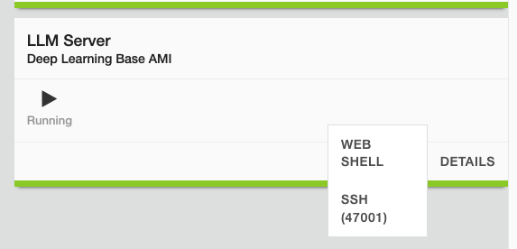
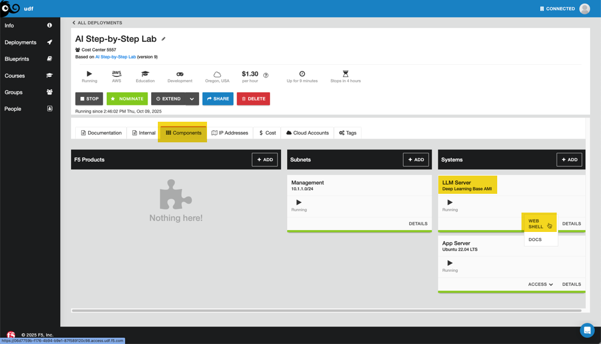

Lab 1.1 - Installing Ollama
===========================

Ollama is a powerful framework that simplifies running and managing large language
models (LLMs) locally or in the cloud. Ollama streamlines the deployment and interaction
with models like LLaMA, Mistral, and others through a lightweight command-line interface
and API. With Ollama, you can quickly spin up language models on your machine, send prompts,
and receive responses—all without relying on external cloud-based services. This makes it
ideal for offline experimentation, privacy-sensitive applications, and edge AI development.
In this lab, you'll explore how to install Ollama and download and run pre-trained models.

Minimum Requirements
--------------------

To run Ollama, you can do so on any modern system, but the more resources you have the better.
Gaming systems with solid GPUs will be necessary with any models of size, but you can work with
small models on any system without a beast of a system.

.. note:: This OS in this lab is Ubuntu. All of this can be recreated with MAC or Windows but
   you'll need to overcome several hurdles. Docker is already installed but the instructions are
   below for your reference.

**Perform these steps from the LLM Server (Web Shell recommended for ease of use)**

Docker

  .. code-block:: bash

     apt update
     apt install -y ca-certificates curl gnupg lsb-release
     mkdir -p /etc/apt/keyrings
     curl -fsSL https://download.docker.com/linux/ubuntu/gpg \
        | gpg --dearmor -o /etc/apt/keyrings/docker.gpg
     echo \
        "deb [arch=$(dpkg --print-architecture) signed-by=/etc/apt/keyrings/docker.gpg] \
        https://download.docker.com/linux/ubuntu \
        $(lsb_release -cs) stable" \
        | tee /etc/apt/sources.list.d/docker.list > /dev/null
     apt update
     apt install -y docker-ce docker-ce-cli containerd.io docker-buildx-plugin docker-compose-plugin

Install Ollama
--------------

In your deployment, click on the **Components** tab, and under **Systems**, click **Access** on the
LLM Server and select **WEB SHELL** as shown in the image below. This will launch the shell which
you will use for the remainder of the labs in this module.

The benefit of using Docker is the install aspect is a bit of a misnomer. Docker is the engine that
is going to simply run the pre-configured install of Ollama in a container. That said, our Ollama
server has an NVIDIA T4 GPU so we need to configure docker to use it before proceeding.

1. Configure Docker for GPU use

.. code-block:: bash

    nvidia-ctk runtime configure --runtime=docker

The output should resemble this:

.. code-block:: bash

    root@ip-10-1-1-5:/# nvidia-ctk runtime configure --runtime=docker
    INFO[0000] Loading config from /etc/docker/daemon.json
    INFO[0000] Wrote updated config to /etc/docker/daemon.json
    INFO[0000] It is recommended that docker daemon be restarted.

.. note:: The NVIDIA toolkit was already pre-installed in the AWS instance we're using. You'll need to
    manage this step if you build your own environment. \ 
    Find the instructions from NVIDIA here: https://docs.nvidia.com/datacenter/cloud-native/container-toolkit/latest/install-guide.html

2. Go ahead and restart docker

.. code-block:: bash

    systemctl restart docker

3. Create a local file resource for Docker so we don't have to re-load models when the container restarts

.. code-block:: bash

    docker volume create model_data

The output should resemble this:

.. code-block:: bash

    root@ip-10-1-1-5:/# docker volume create model_data
    model_data

4. Run the Ollama container, making sure to reference the volume we created

.. code-block:: bash

    docker run -d -v model_data:/root/.ollama -p 11434:11434 --name ollama ollama/ollama

The output should resemble this:

.. code-block:: bash

    root@ip-10-1-1-5:/root# docker run -d -v model_data:/root/.ollama -p 11434:11434 --name ollama ollama/ollama
    Unable to find image 'ollama/ollama:latest' locally
    latest: Pulling from ollama/ollama
    b08e2ff4391e: Pull complete
    9d52186ca5a2: Pull complete
    d0343d5f73e9: Pull complete
    5343bc64fdab: Pull complete
    Digest: sha256:f478761c18fea69b1624e095bce0f8aab06825d09ccabcd0f88828db0df185ce
    Status: Downloaded newer image for ollama/ollama:latest
    bf7f9f4c88acac99d7930d695768183f1a1f930960181c17b1a360508addcadb

5. Check to see if the container is running

.. code-block:: bash

    docker ps

The output should resemble this:

.. code-block:: bash

    root@ip-10-1-1-5:/root# docker ps
    CONTAINER ID   IMAGE           COMMAND               CREATED         STATUS         PORTS                                             NAMES
    bf7f9f4c88ac   ollama/ollama   "/bin/ollama serve"   2 minutes ago   Up 2 minutes   0.0.0.0:11434->11434/tcp, [::]:11434->11434/tcp   ollama

6. Check to see if Ollama is available by using the curl command

.. code-block:: bash

    curl http://127.0.0.1:11434

The output should resemble this:

.. code-block:: bash

    root@ip-10-1-1-5:/root# curl http://127.0.0.1:11434
    Ollama is running

Alternate Path -- Use Docker Compose
------------------------------------

Docker Compose is a tool for defining and running multi-container Docker applications
using a YAML configuration file, whereas individual Docker commands manage containers
one at a time through the command line. With Docker Compose, you can declaratively
specify your entire application stack - including services, networks, volumes, and
their relationships - in a single file that can be version controlled and easily shared
with your team.

The main advantages of using Docker Compose over individual Docker commands include
simplified management of complex applications (especially those with multiple
interconnected services), reproducible deployments across different environments, and the
ability to start, stop, and rebuild your entire application stack with simple commands like
docker-compose up and docker-compose down. It's particularly valuable when you need to
coordinate multiple containers, manage dependencies between services, or ensure consistent
configuration across development, testing, and production environments.

.. note:: For this Ollama setup we obviously don't have multiple containers, but it's still
    helpful to use the yaml declarations to avoid all the command line entry. Your setup is
    already working and you can move on. The declaration below creates the
    model_data volume and the ollama container when you run **docker compose up -d** in the folder
    where the compose.yaml file is stored.

.. code-block:: docker

    services:
      ollama:
        image: ollama/ollama
        container_name: ollama
        ports:
          - "0.0.0.0:11434:11434"
        volumes:
          - model_data:/root/.ollama
        restart: unless-stopped

    volumes:
      model_data:

When run, the output should resemble this:

.. code-block:: bash

    root@ip-10-1-1-5:/root/ollama# docker compose up -d
    [+] Running 3/3
     ✔ Network ollama_default      Created                                                                                                                           0.0s
     ✔ Volume "ollama_model_data"  Created                                                                                                                           0.0s
     ✔ Container ollama            Started                                                                                                                           0.3s

    root@ip-10-1-1-5:/root/ollama# docker ps
    CONTAINER ID   IMAGE           COMMAND               CREATED          STATUS          PORTS                      NAMES
    4946cc3abe94   ollama/ollama   "/bin/ollama serve"   18 seconds ago   Up 18 seconds   0.0.0.0:11434->11434/tcp   ollama

    root@ip-10-1-1-5:/root/ollama# docker volume ls
    DRIVER    VOLUME NAME
    local     ollama_model_data

Recap
-----
You now have the following:

- Docker configured to take advantage of the system GPU
- A Docker container running the Ollama server
- A Docker volume which is used as the file repository to store the models we'll install so they survive container restarts

Next we'll install a couple models.
