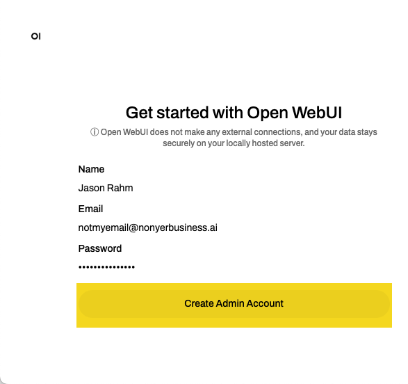
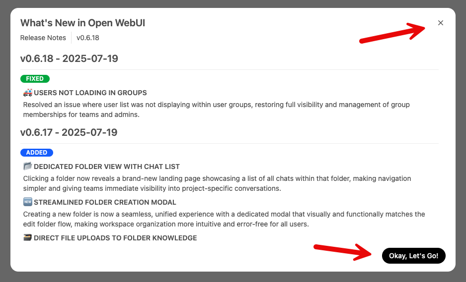

Lab 2.1 - Installing & Configuring Open WebUI
=============================================

In your deployment, click on the **Components** tab, and under **Systems**, click **Access** on the
Jumphost and select **WEB SHELL** as shown in the image below.

.. image:: images/00_jumphost_webshell_interface.png

1. Create a docker volume for Open WebUI to persist data across container restarts.

.. code-block:: bash

    docker volume create openwebui_data

The output should resemble this:

.. code-block:: bash

    root@ip-10-1-1-4:/# docker volume create openwebui_data
    openwebui_data

2. Now start the open-webui container image. It'll pull it down since it's not local. It isn't
necessary to set the ``OLLAMA_BASE_URL`` in the docker command as you can do it in the GUI, but
it saves a step.

.. code-block:: bash

    docker run -d -p 0.0.0.0:3000:8080 \
      -e OLLAMA_BASE_URL=http://10.1.1.5:11434 \
      -v openwebui_data:/app/backend/data \
      --name open-webui \
      --restart always \
      ghcr.io/open-webui/open-webui:main

The output should resemble this:

.. code-block:: bash

    root@ip-10-1-1-4:/# docker run -d -p 0.0.0.0:3000:8080 \
      -e OLLAMA_BASE_URL=http://10.1.1.5:11434 \
      -v openwebui_data:/app/backend/data \
      --name open-webui \
      --restart always \
      ghcr.io/open-webui/open-webui:main
    Unable to find image 'ghcr.io/open-webui/open-webui:main' locally
    main: Pulling from open-webui/open-webui
    59e22667830b: Pull complete
    abd846fa1cdb: Pull complete
    b7b61708209a: Pull complete
    4085babbc570: Pull complete
    5f3e67ee2caa: Pull complete
    4f4fb700ef54: Pull complete
    61b789e681cb: Pull complete
    bd138afc061f: Pull complete
    958261b47794: Pull complete
    e4cb927d1520: Pull complete
    110986ba15fd: Pull complete
    1107fb21b6a6: Pull complete
    a0d156d51aeb: Pull complete
    47f2db3d35c9: Pull complete
    2d6845a877ec: Pull complete
    Digest: sha256:1addcd1bd7f8adfa635855bc8dfb91efc11632a3ca1ed0c0cc9424b82a5975d6
    Status: Downloaded newer image for ghcr.io/open-webui/open-webui:main
    cdb6f8b014622d78ec5442885ec2eaca2bbc454082b01d832cdeb324beda0324

3. Now run ``docker ps`` to make sure the container is running and healthy.

.. code-block:: bash

    docker ps

The output should resemble this. Make sure you see healthy under the STATUS field before proceeding.
Mine took about a minute after startup.

.. code-block:: bash

    root@ip-10-1-1-4:/# docker ps
    CONTAINER ID   IMAGE                                COMMAND           CREATED         STATUS                   PORTS                    NAMES
    cdb6f8b01462   ghcr.io/open-webui/open-webui:main   "bash start.sh"   5 minutes ago   Up 5 minutes (healthy)   0.0.0.0:3000->8080/tcp   open-webui

4. Now go to your deployment, click on the **Components** tab, and under **Systems**,
click **Access** on the Jumphost and select **OPEN WEBUI** as shown in the image below.

.. image:: images/01_openwebui_access.png

5. You should be presented with a screen similar to this in your browser. Click
**Get started** at the bottom.

6. At this next screen, you will need to create an account. You can supply a fake
properly-formatted email address.

7. Read or ignore the release notes dialog box and either hit the **x** in the upper
right corner or the **Okay, Let's Go!** button in the bottom right corner.

If your ollama container is still running on the LLM Server (and it should be),
your browser screen should resemble this:

.. image:: images/04_openwebui_chatbot_main.png

8. Note the model dropdown in the upper left corner. This should feature all your models from
Module 1.

.. image:: images/04_openwebui_modellist.png

.. note::
    If there are none, open your web shell for the LLM Server and run ``docker ps`` to make sure ollama
    is running. If it isn't and you've completed Module 1, you should be able to run ``docker start ollama``
    to get it running again.
    
9. Select a model of your choice and run a quick test.

.. image:: images/04_openwebui_testprompt.png

.. note::
    We pre-configured Ollama in the docker command, but you can also connect to any OpenAI compatible
    API endpoints. That is not in scope for this lab (and not recommended), but if you have an OpenAI
    API key and want to test, you can click your name in the lower left corner, click **Settings**, then
    **Connections**, then click the "+" sign to the right of **Manage Direct Connections** and fill in
    the details.

10. Ok, you tested a model interactively and via the API from curl in Module 1, now take them for a test
drive in a very ChatGPT-like experience! Feel free to pick the model, then prompt and go! Your session
should resemble this one:

.. image:: images/05_openwebui_chatbot_prompt.png

Now take a step back and see what you've just built. You have your own working generative AI environment!
And your prompt session history in the left-hand menu, no less. Not too shabby, right?!?

You might have noticed that your initial prompt took a hot minute to get a response. This is due to the
way Ollama is set up in docker by default. When you ran a model in Module 1 via a ``docker exec``
command within the container, it loaded that model into memory, but only for a short while. You can see
when I drop the model list down that there is a green dot next to tinylama, indicating that the model is
loaded, and hovering over the green dot shows the tool tip that it will unload in 4 minutes.

.. image:: images/06_openwebui_chatbot_models.png

.. note::
    Also out of scope for this lab, but powerful, is the ability to assign models and set specific system
    prompts. This makes for a great family tool for keeping costs down to shared API usage, but also for
    settings access and authorization permissions based on users and groups that you can define.

Feel free to hang out here before moving on and test the different models with a similar prompt to see
how effective they are at answering your queries. The smaller models tend to hallucinate a lot and to
not follow prompt instructions very precisely, or at all.

Recap
-----
You now have the following:

- A full-featured web-based front-end for working with Ollama models.

Next we'll crawl back to the command line for the exciting and powerful Fabric framework.
