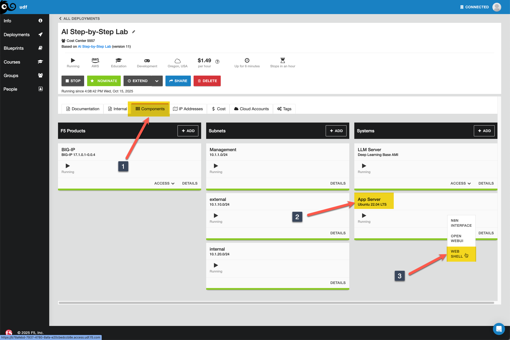
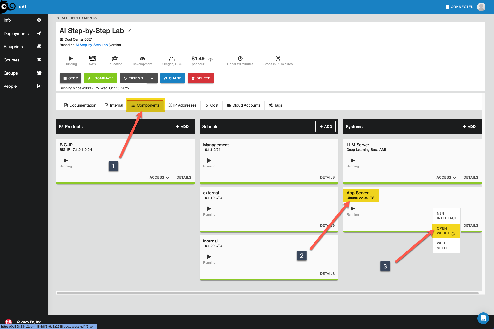
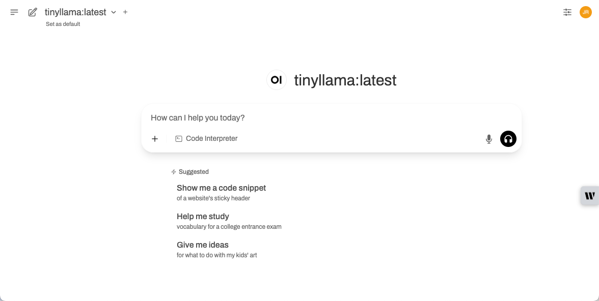
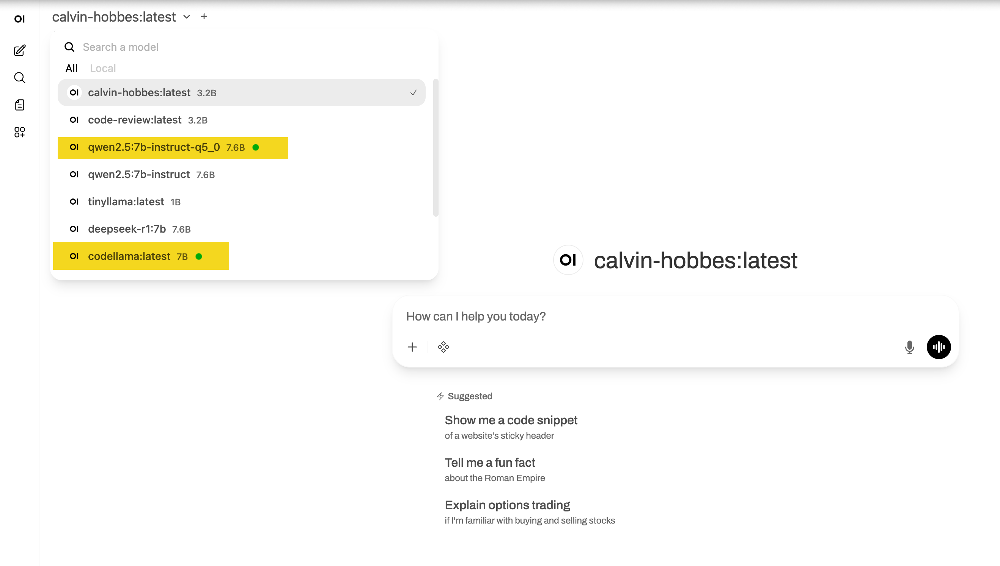
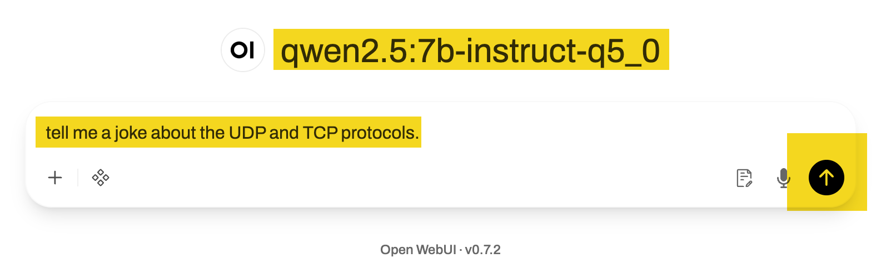
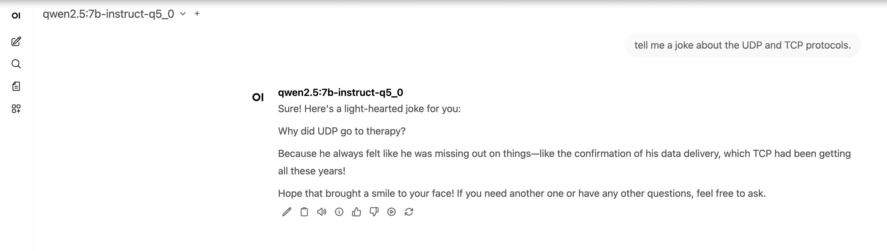
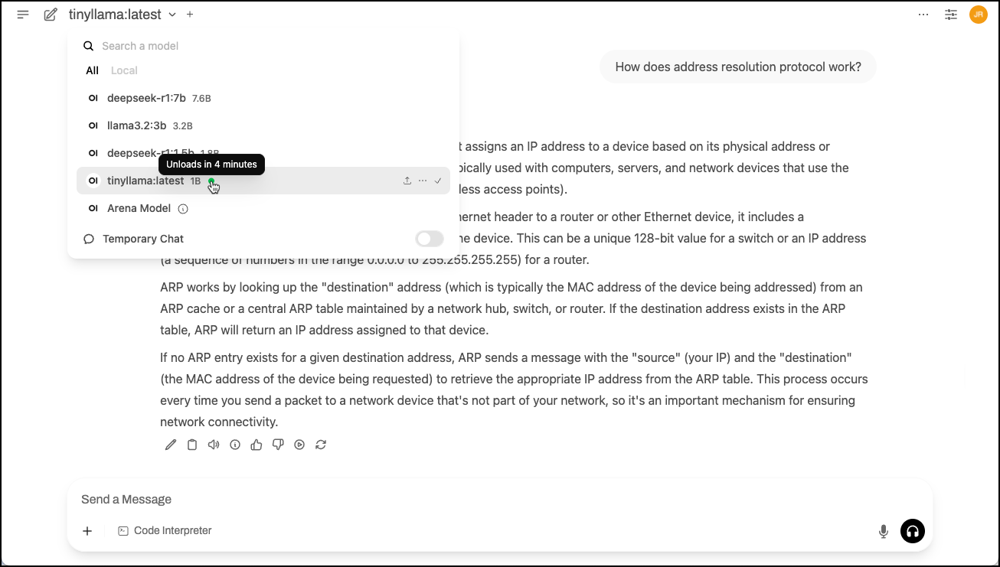

Lab 2.1 - Installing & Configuring Open WebUI
=============================================

In your deployment, click on the **Components** tab, and under **Systems**, click **Access** on the
App Server and select **WEB SHELL** as shown in the image below.

1. Review the Open WebUI compose file on the **App Server** in the web shell.

.. code-block:: console

    cd /root/open-webui
    cat compose.yaml

The output should resemble this:

.. code-block:: console

    root@ip-10-1-1-4:/# cd /root/open-webui
    root@ip-10-1-1-4:/root/open-webui# cat compose.yaml
    services:
      open-webui:
        image: ghcr.io/open-webui/open-webui:main
        container_name: open-webui
        ports:
          - "0.0.0.0:3000:8080"
        environment:
          - OLLAMA_BASE_URL=http://10.1.1.5:11435
          - WEBUI_AUTH=False
        volumes:
          - openwebui_data:/app/backend/data
        networks:
          - labnet
        restart: always

    volumes:
      openwebui_data:
        name: openwebui_data

    networks:
      labnet:
        external: true
        name: labnet

Note the ollama URL uses our LLM server IP address and the port of our GPU Ollama instance. We'll need the GPU for the
second lab in this module, so we'll load that one as the base here. Also note that we've disabled authentication to
Open WebUI in this lab. Normally you'd want to keep that enabled so you can control access and set up profiles,
but it's unnecessary here and requires interaction with one of your email accounts to get an activation key so we've disabled it.

2. Run the Open WebUI compose service. It isn't necessary to set the ``OLLAMA_BASE_URL`` in the docker command as you
can do it in the GUI, but it saves a step.

.. code-block:: docker

    docker compose up -d

The output should resemble this since we've already pre-built this:

.. code-block:: console

    root@ip-10-1-1-4:/root/open-webui# docker compose up -d
    [+] Running 1/1
     ✔ Container open-webui  Started

If it were the first time, the output would look like this:

.. code-block:: console

    root@ip-10-1-1-4:/root/open-webui# docker compose up -d
    [+] Running 16/16
     ✔ open-webui Pulled                                                                                                                                                                                                     81.3s
       ✔ 5c32499ab806 Pull complete                                                                                                                                                                                           3.7s
       ✔ 38b7e0d95f77 Pull complete                                                                                                                                                                                           4.0s
       ✔ a64c132cd1a4 Pull complete                                                                                                                                                                                           5.3s
       ✔ d61a97008ede Pull complete                                                                                                                                                                                           5.4s
       ✔ 00b82f66b7ae Pull complete                                                                                                                                                                                           5.4s
       ✔ 4f4fb700ef54 Pull complete                                                                                                                                                                                           5.5s
       ✔ 0dba137e9547 Pull complete                                                                                                                                                                                           5.5s
       ✔ c1a269532a5f Pull complete                                                                                                                                                                                           5.6s
       ✔ 9838dc956351 Pull complete                                                                                                                                                                                          24.2s
       ✔ 4e5a20d7c2d9 Pull complete                                                                                                                                                                                          24.2s
       ✔ f0362419171e Pull complete                                                                                                                                                                                          76.2s
       ✔ 2e2ace3a420a Pull complete                                                                                                                                                                                          79.6s
       ✔ 930613edf9e8 Pull complete                                                                                                                                                                                          79.7s
       ✔ c536edf69b32 Pull complete                                                                                                                                                                                          79.7s
       ✔ 5dd5a2ad364d Pull complete                                                                                                                                                                                          80.5s
    [+] Running 2/2
     ✔ Volume "openwebui_data"  Created                                                                                                                                                                                       0.0s
     ✔ Container open-webui     Started

3. Now run **docker ps** to make sure the container is running and healthy.

.. code-block:: console

    docker ps

The output should resemble this.

.. code-block:: console

    root@ip-10-1-1-4:/root/open-webui# docker ps
    CONTAINER ID   IMAGE                                COMMAND           CREATED              STATUS                        PORTS                    NAMES
    9f5371a4223c   ghcr.io/open-webui/open-webui:main   "bash start.sh"   About a minute ago   Up About a minute (healthy)   0.0.0.0:3000->8080/tcp   open-webui

.. important::

    Make sure you see healthy under the STATUS field and wait at least a minute before proceeding. If it starts unhealthy,
    do a **docker compose restart**.

4. Now go to your deployment, click on the **Components** tab, and under **Systems**,
click **Access** on the **App Server** and select **OPEN WEBUI** as shown in the image below.

Click the "Ok, Let's Go!" on the welcome dialog. If your ollama container is still running on the LLM Server (and it should be),
your browser screen should resemble this:

5. Note the model dropdown in the upper left corner. This should feature all your models from
Module 1.

.. note::
    If there are none, open your web shell for the **LLM Server** and run **docker ps** to make sure ollama
    is running. If it isn't and you've completed Module 1, you should be able to run **docker compose up -d**
    on the LLM server in the /root/ollama directory to get it running again. If it is running but you still can't
    see any models in the drop down, type **docker compose restart open-webui** in the **App Server** web shell in
    the /root/open-webui directory and wait a minute until the status is healthy. Reach out to your lab asssistant
    if none of this helps.
    
6. Select either the qwen q5 instruct model or the codellama model and run a quick test.

.. note::
    We pre-configured Ollama in the docker command, but you can also connect to any OpenAI compatible
    API endpoints. That is not in scope for this lab (and not recommended), but if you have an OpenAI
    API key and want to test, you can click your name in the lower left corner, click **Settings**, then
    **Connections**, then click the "+" sign to the right of **Manage Direct Connections** and fill in
    the details.

7. Ok, you tested a model interactively and via the API from curl in Module 1, now take them for a test
drive in a very ChatGPT-like experience! Feel free to pick the model, then prompt and go! Your session
should resemble this one:

Now take a step back and see what you've just built. You have your own working generative AI environment!
And your prompt session history in the left-hand menu, no less. Not too shabby, right?!?

Depending on the model you chose, you might have noticed that your initial prompt took a hot minute to get
a response. This is due to the way Ollama is set up in docker by default. When you ran a model in Module 1
via a ``docker exec`` command within the container, it loaded that model into memory, but only for a short
while after the first five models, which are set to stay loaded forever. You can see when I drop the model
list down that there is a green dot next to the loaded models. Hovering over the model's green dot shows the
tool tip that it will unload in 292 years. I think you'll make it through the lab!

.. note::
    Also out of scope for this lab, but powerful, is the ability to assign models and set specific system
    prompts. This makes for a great family tool for keeping costs down to shared API usage, but also for
    settings access and authorization permissions based on users and groups that you can define.

Feel free to hang out here before moving on and test the other GPU model (qwen q5 instruct or codellama, whichever you
didn't test above.) Try to avoid loading the CPU models for now. We'll have a better option for that in a later module.

8. You will need to make changes to the Open WebUI compose file in the next lab. Shut it down for now.

.. code-block:: console

    cd /root/open-webui
    docker compose down

Recap
-----
You now have the following:

- A full-featured web-based front-end for working with Ollama models.

Next we'll enhance our front-end by adding the mcpo MCP proxy tool and test out a couple MCP servers.
