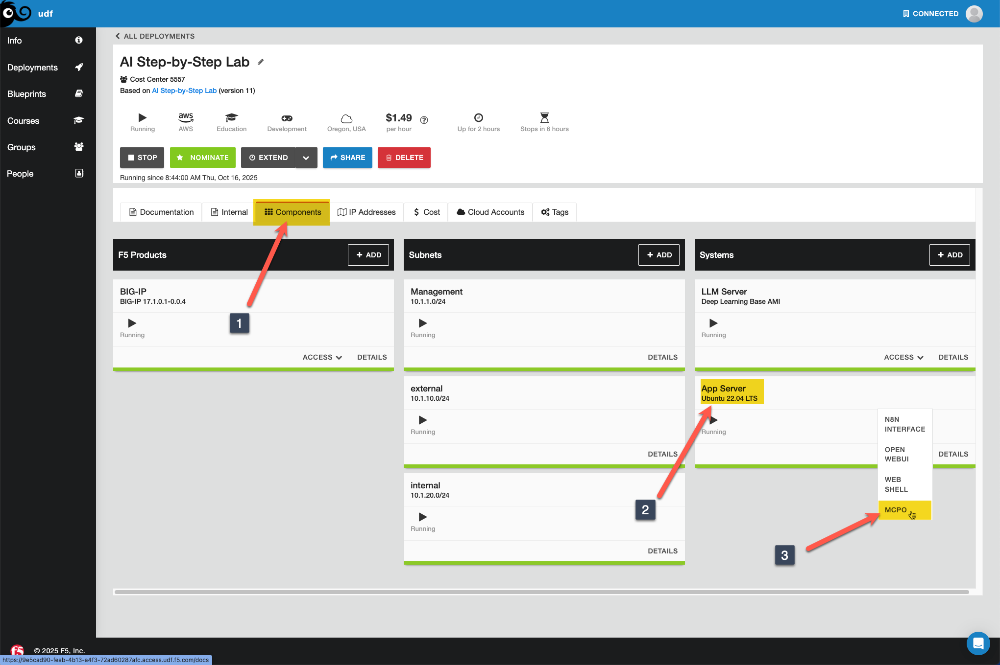
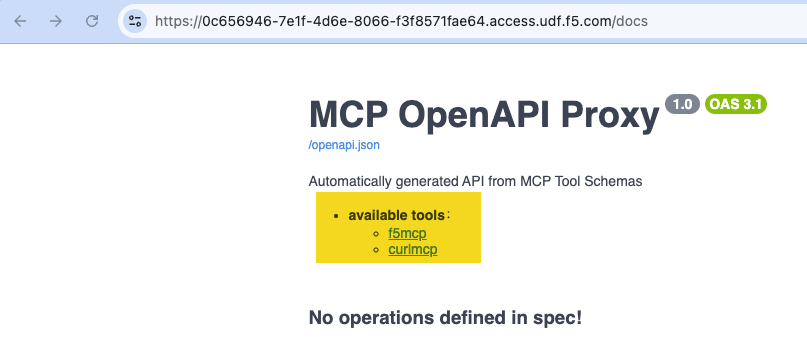
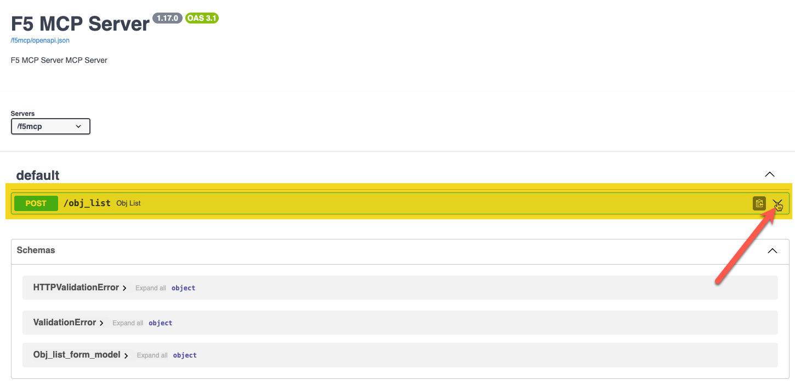
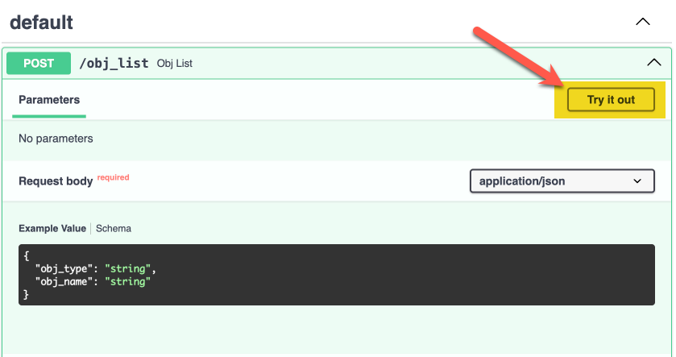
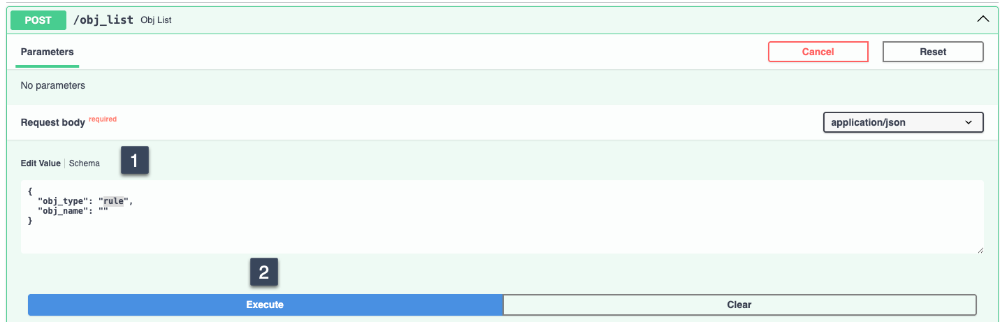
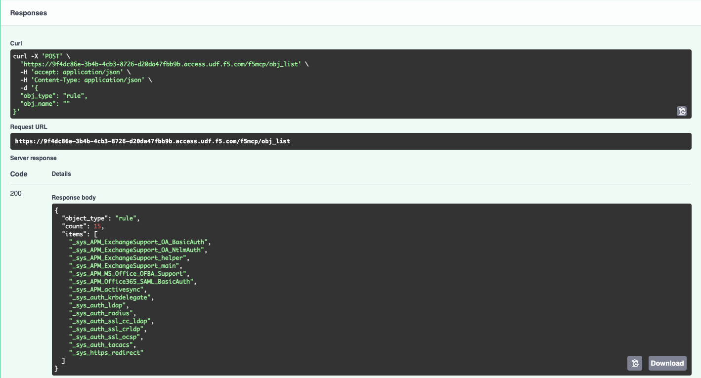
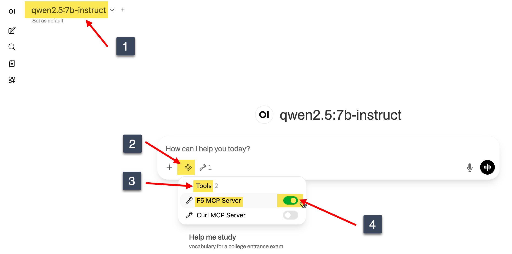
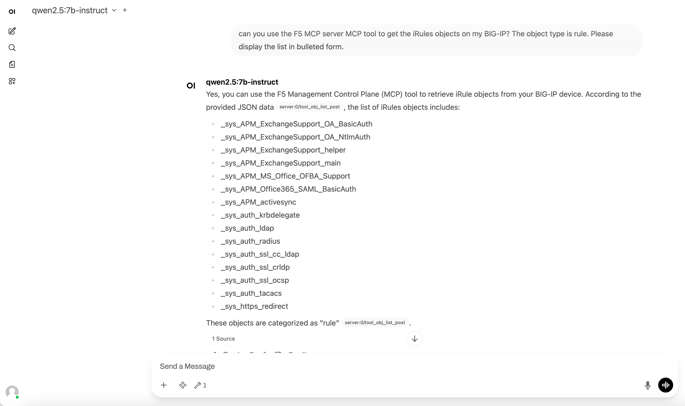

Lab 2.2 - Bridging MCP Tools with Open WebUI through MCPO
=========================================================

The Model Context Protocol (MCP) represents a fundamental shift in how AI systems interact
with the world beyond their training data. Developed by Anthropic as an open standard, MCP
provides a unified interface that allows large language models to connect to external tools,
databases, APIs, and services in real-time.

Rather than relying solely on their static knowledge cutoffs, AI models equipped with MCP
can dynamically access current information, execute code, manipulate files, query databases,
and interact with complex systems like network infrastructure, cloud services, or enterprise
applications. What makes MCP particularly powerful is its standardized approach - developers
can create MCP servers that expose specific capabilities (like interacting with a BIG-IP
integration in this lab), and any MCP-compatible AI system can immediately leverage those
tools without custom integrations. This creates an ecosystem where AI assistants can
seamlessly transition from answering questions to taking concrete actions, transforming them
from passive information sources into active operational partners capable of real-world system
administration, data analysis, and automation tasks.

What you're building
--------------------

In this lab, you'll extend your Open WebUI / Ollama environment to include the use of local MCP
servers. I've been using Anthropic's Claude with the Docker MCP toolkit on my Mac, but given
that Claude is a remote model, I don't really want to share credentials. From Open WebUI, you
can connect to tools a couple different ways.

1. Python scripts hosted within the Open WebUI context
2. Using mcpo, which stands for MCP-to-OpenAPI proxy server

We're pursuing option 2 in this lab. Mcpo acts as an intermediary that manages connections between
Open WebUI and multiple MCP servers, and can handle authentication, routing, and protocol
translation. When prompting the AI model to perform a task that requires external tools, the request
flows from Open WebUI to the local Ollama model instance for natural language processing, then back
to Open WebUI which determines if external tools are needed. If so, the request is forwarded to mcpo,
which routes it to the appropriate MCP server - in this case, the F5 MCP server that can interact
with BIG-IP systems. The MCP server executes the requested action, returns structured data to mcpo,
which then passes it back through Open WebUI and the LLM to be presented as natural language
responses. The F5 MCP server in this lab is dead simple with a single tool to return the list of
objects (like virtuals, pools, rules, etc) or the specific oject type by name.

The environment looks like this architecturally:

.. mermaid::

    flowchart TD
        A[Open WebUI Chat :3000] --> B[Ollama :11434]
        A --> C[MCPO Proxy :8000]
        C --> D[F5 MCP Server :8081]
        D --> E[BIG-IP]

        B --> F[LLMs]
        C --> G[Curl MCP Server :8082]

Initial Setup: Install and Launch mcpo
--------------------------------------

1. In your deployment, click on the **Components** tab, and under **Systems**, click **Access** on the
App Server and select **WEB SHELL** as shown in the image below.

.. image:: images/00_appserver_webshell_interface.png

2. Clone the f5-mcp repo into the /root directory

.. code-block:: console

    cd /root
    git clone https://github.com/f5-rahm/f5-mcp.git

3. The output should resemble this:

.. code-block:: console

    root@ip-10-1-1-4:/# cd /root
    root@ip-10-1-1-4:/root# git clone https://github.com/f5-rahm/f5-mcp.git
    Cloning into 'f5-mcp'...
    remote: Enumerating objects: 42, done.
    remote: Counting objects: 100% (42/42), done.
    remote: Compressing objects: 100% (37/37), done.
    remote: Total 42 (delta 11), reused 25 (delta 2), pack-reused 0 (from 0)
    Receiving objects: 100% (42/42), 18.50 KiB | 4.63 MiB/s, done.
    Resolving deltas: 100% (11/11), done.

4. For this lab, the .env files for mcpo and for the BIG-IP and the compose.yaml are already pre-
configured for you, but if you take this for your own use you'll need to update those to match
your environment. There are three services in this repo:

    1. mcpo Proxy
    2. f5mcp MCP server
    3. curlmcp MCP server

I recommend taking a peek at the files to see how everything fits together, butif you just want to
get on with it, cd into the cloned directory and launch the compose file.

.. code-block:: console

    cd f5-mcp
    docker compose up

The output is extensive, and should resemble below. You can scroll past, but it's interesting to see
the startup process for each MCP server and mcpo

.. code-block:: console

    root@ip-10-1-1-4:/root/f5-mcp# docker compose up
    [+] Running 13/13
     ✔ mcpo Pulled                                                                                                                                                                                                          26.9s
       ✔ 5c32499ab806 Already exists                                                                                                                                                                                         0.0s
       ✔ 12adf7172004 Pull complete                                                                                                                                                                                          1.0s
       ✔ 9c0ae650ccc7 Pull complete                                                                                                                                                                                          4.2s
       ✔ 491352492d5b Pull complete                                                                                                                                                                                          4.3s
       ✔ 3e12acdbda16 Pull complete                                                                                                                                                                                          5.5s
       ✔ f6f15deacfe5 Pull complete                                                                                                                                                                                          9.6s
       ✔ b37b3eece980 Pull complete                                                                                                                                                                                         22.4s
       ✔ fc5b46c84b7d Pull complete                                                                                                                                                                                         22.5s
       ✔ c61fb62a9815 Pull complete                                                                                                                                                                                         22.6s
       ✔ 4f4fb700ef54 Pull complete                                                                                                                                                                                         22.6s
       ✔ 274bb3e817c7 Pull complete                                                                                                                                                                                         22.7s
       ✔ e975859e1585 Pull complete                                                                                                                                                                                         25.9s
    [+] Building 91.6s (23/23) FINISHED
     => [internal] load local bake definitions                                                                                                                                                                               0.0s
     => => reading from stdin 593B                                                                                                                                                                                           0.0s
     => [f5mcp internal] load build definition from Dockerfile                                                                                                                                                               0.1s
     => => transferring dockerfile: 298B                                                                                                                                                                                     0.0s
     => [curlmcp internal] load build definition from Dockerfile                                                                                                                                                             0.1s
     => => transferring dockerfile: 297B                                                                                                                                                                                     0.0s
     => [f5mcp internal] load metadata for docker.io/library/python:3.11-slim                                                                                                                                                1.0s
     => [f5mcp internal] load .dockerignore                                                                                                                                                                                  0.1s
     => => transferring context: 2B                                                                                                                                                                                          0.0s
     => [curlmcp internal] load .dockerignore                                                                                                                                                                                0.1s
     => => transferring context: 2B                                                                                                                                                                                          0.0s
     => [f5mcp 1/6] FROM docker.io/library/python:3.11-slim@sha256:ff8533f48e12b705fc20d339fde2ec61d0b234dd9366bab3bc84d7b70a45c8c0                                                                                         10.9s
     => => resolve docker.io/library/python:3.11-slim@sha256:ff8533f48e12b705fc20d339fde2ec61d0b234dd9366bab3bc84d7b70a45c8c0                                                                                                0.1s
     => => sha256:6818dcc897e2708bf24af119860e4d678d9d40a725264beb20d4988deef1ccfe 1.75kB / 1.75kB                                                                                                                           0.0s
     => => sha256:7bbe597de5c76e70498898003b3e0402a6f4ef23b0ba30d33acd8d1af863f128 5.38kB / 5.38kB                                                                                                                           0.0s
     => => sha256:8c7716127147648c1751940b9709b6325f2256290d3201662eca2701cadb2cdf 29.78MB / 29.78MB                                                                                                                         1.2s
     => => sha256:c72c567266265eaf3c81cecf291e32dc35cb03f44a34cc37c4bb2c3f1ca6741c 4.25MB / 4.25MB                                                                                                                           0.5s
     => => sha256:76d93c681ade9d7ff7e4e590094f416d05d02ce51cb023dbb97acd48c3073470 14.36MB / 14.36MB                                                                                                                         0.7s
     => => sha256:ff8533f48e12b705fc20d339fde2ec61d0b234dd9366bab3bc84d7b70a45c8c0 10.37kB / 10.37kB                                                                                                                         0.0s
     => => sha256:80061c640d6316e0810fd1007261f33680529077a173449bba4b55579c66db45 250B / 250B                                                                                                                               0.8s
     => => extracting sha256:8c7716127147648c1751940b9709b6325f2256290d3201662eca2701cadb2cdf                                                                                                                                4.7s
     => => extracting sha256:c72c567266265eaf3c81cecf291e32dc35cb03f44a34cc37c4bb2c3f1ca6741c                                                                                                                                0.6s
     => => extracting sha256:76d93c681ade9d7ff7e4e590094f416d05d02ce51cb023dbb97acd48c3073470                                                                                                                                3.5s
     => => extracting sha256:80061c640d6316e0810fd1007261f33680529077a173449bba4b55579c66db45                                                                                                                                0.0s
     => [curlmcp internal] load build context                                                                                                                                                                                0.1s
     => => transferring context: 2.41kB                                                                                                                                                                                      0.0s
     => [f5mcp internal] load build context                                                                                                                                                                                  0.1s
     => => transferring context: 1.15kB                                                                                                                                                                                      0.0s
     => [curlmcp 2/6] WORKDIR /app                                                                                                                                                                                           1.5s
     => [curlmcp 3/6] RUN apt-get update &&     apt-get install -y curl &&     rm -rf /var/lib/apt/lists/*                                                                                                                  19.2s
     => [f5mcp 3/7] RUN apt-get update && apt-get install -y     && rm -rf /var/lib/apt/lists/*                                                                                                                              9.3s
     => [f5mcp 4/7] COPY requirements.txt .                                                                                                                                                                                  0.1s
     => [f5mcp 5/7] RUN pip install --no-cache-dir -r requirements.txt                                                                                                                                                      57.4s
     => [curlmcp 4/6] COPY requirements.txt .                                                                                                                                                                                0.2s
     => [curlmcp 5/6] RUN pip install --no-cache-dir -r requirements.txt                                                                                                                                                    55.5s
     => [f5mcp 6/7] COPY main.py .                                                                                                                                                                                           0.2s
     => [f5mcp 7/7] COPY .env .                                                                                                                                                                                              0.1s
     => [f5mcp] exporting to image                                                                                                                                                                                           2.7s
     => => exporting layers                                                                                                                                                                                                  2.6s
     => => writing image sha256:1b6b89c3dd7cba6af7d2f9d9b66602a1480041c0befbe61c44fd106a83b37f35                                                                                                                             0.0s
     => => naming to docker.io/library/f5-mcp-f5mcp                                                                                                                                                                          0.0s
     => [f5mcp] resolving provenance for metadata file                                                                                                                                                                       0.1s
     => [curlmcp 6/6] COPY main.py .                                                                                                                                                                                         0.1s
     => [curlmcp] exporting to image                                                                                                                                                                                         2.6s
     => => exporting layers                                                                                                                                                                                                  2.6s
     => => writing image sha256:a33e1fdfca407d4b45a3f0415eadbd91daa6600d1354ae9329f87beb0bb63f27                                                                                                                             0.0s
     => => naming to docker.io/library/f5-mcp-curlmcp                                                                                                                                                                        0.0s
     => [curlmcp] resolving provenance for metadata file                                                                                                                                                                     0.0s
    [+] Running 5/5
     ✔ curlmcp            Built                                                                                                                                                                                              0.0s
     ✔ f5mcp              Built                                                                                                                                                                                              0.0s
     ✔ Container curlmcp  Created                                                                                                                                                                                            0.2s
     ✔ Container f5mcp    Created                                                                                                                                                                                            0.2s
     ✔ Container mcpo     Created                                                                                                                                                                                            0.1s
    Attaching to curlmcp, f5mcp, mcpo
    curlmcp  |
    curlmcp  |
    curlmcp  | ╭────────────────────────────────────────────────────────────────────────────╮
    curlmcp  | │                                                                            │
    curlmcp  | │        _ __ ___  _____           __  __  _____________    ____    ____     │
    curlmcp  | │       _ __ ___ .'____/___ ______/ /_/  |/  / ____/ __ \  |___ \  / __ \    │
    curlmcp  | │      _ __ ___ / /_  / __ `/ ___/ __/ /|_/ / /   / /_/ /  ___/ / / / / /    │
    curlmcp  | │     _ __ ___ / __/ / /_/ (__  ) /_/ /  / / /___/ ____/  /  __/_/ /_/ /     │
    curlmcp  | │    _ __ ___ /_/    \____/____/\__/_/  /_/\____/_/      /_____(*)____/      │
    curlmcp  | │                                                                            │
    curlmcp  | │                                                                            │
    curlmcp  | │                                FastMCP  2.0                                │
    curlmcp  | │                                                                            │
    curlmcp  | │                                                                            │
    curlmcp  | │                🖥  Server name:     Curl MCP Server
    curlmcp  | │                📦 Transport:       Streamable-HTTP
    curlmcp  | │                🔗 Server URL:      http://0.0.0.0:8082/mcp
    curlmcp  | │                                                                            │
    curlmcp  | │                🏎  FastMCP version: 2.12.4
    curlmcp  | │                🤝 MCP SDK version: 1.17.0
    curlmcp  | │                                                                            │
    curlmcp  | │                📚 Docs:            https://gofastmcp.com
    curlmcp  | │                🚀 Deploy:          https://fastmcp.cloud
    curlmcp  | │                                                                            │
    curlmcp  | ╰────────────────────────────────────────────────────────────────────────────╯
    curlmcp  |
    curlmcp  |
    curlmcp  | [10/16/25 15:05:36] INFO     Starting MCP server 'Curl MCP        server.py:1579
    curlmcp  |                              Server' with transport 'http' on
    curlmcp  |                              http://0.0.0.0:8082/mcp
    curlmcp  | INFO:     Started server process [1]
    curlmcp  | INFO:     Waiting for application startup.
    curlmcp  | INFO:     Application startup complete.
    curlmcp  | INFO:     Uvicorn running on http://0.0.0.0:8082 (Press CTRL+C to quit)
    f5mcp    |
    f5mcp    |
    f5mcp    | ╭────────────────────────────────────────────────────────────────────────────╮
    f5mcp    | │                                                                            │
    f5mcp    | │        _ __ ___  _____           __  __  _____________    ____    ____     │
    f5mcp    | │       _ __ ___ .'____/___ ______/ /_/  |/  / ____/ __ \  |___ \  / __ \    │
    f5mcp    | │      _ __ ___ / /_  / __ `/ ___/ __/ /|_/ / /   / /_/ /  ___/ / / / / /    │
    f5mcp    | │     _ __ ___ / __/ / /_/ (__  ) /_/ /  / / /___/ ____/  /  __/_/ /_/ /     │
    f5mcp    | │    _ __ ___ /_/    \____/____/\__/_/  /_/\____/_/      /_____(*)____/      │
    f5mcp    | │                                                                            │
    f5mcp    | │                                                                            │
    f5mcp    | │                                FastMCP  2.0                                │
    f5mcp    | │                                                                            │
    f5mcp    | │                                                                            │
    f5mcp    | │                🖥  Server name:     F5 MCP Server
    f5mcp    | │                📦 Transport:       Streamable-HTTP
    f5mcp    | │                🔗 Server URL:      http://0.0.0.0:8081/mcp
    f5mcp    | │                                                                            │
    f5mcp    | │                🏎  FastMCP version: 2.12.4
    f5mcp    | │                🤝 MCP SDK version: 1.17.0
    f5mcp    | │                                                                            │
    f5mcp    | │                📚 Docs:            https://gofastmcp.com
    f5mcp    | │                🚀 Deploy:          https://fastmcp.cloud
    f5mcp    | │                                                                            │
    f5mcp    | ╰────────────────────────────────────────────────────────────────────────────╯
    f5mcp    |
    f5mcp    |
    f5mcp    | [10/16/25 15:05:37] INFO     Starting MCP server 'F5 MCP Server'  server.py:1579
    f5mcp    |                              with transport 'http' on
    f5mcp    |                              http://0.0.0.0:8081/mcp
    f5mcp    | INFO:     Started server process [1]
    f5mcp    | INFO:     Waiting for application startup.
    f5mcp    | INFO:     Application startup complete.
    f5mcp    | INFO:     Uvicorn running on http://0.0.0.0:8081 (Press CTRL+C to quit)
    mcpo     | 2025-10-16 15:05:42,071 - INFO - Starting MCPO Server...
    mcpo     | 2025-10-16 15:05:42,074 - INFO -   Name: MCP OpenAPI Proxy
    mcpo     | 2025-10-16 15:05:42,074 - INFO -   Version: 1.0
    mcpo     | 2025-10-16 15:05:42,075 - INFO -   Description: Automatically generated API from MCP Tool Schemas
    mcpo     | 2025-10-16 15:05:42,075 - INFO -   Hostname: c1e122594c66
    mcpo     | 2025-10-16 15:05:42,075 - INFO -   Port: 8000
    mcpo     | 2025-10-16 15:05:42,075 - INFO -   API Key: Not Provided
    mcpo     | 2025-10-16 15:05:42,075 - INFO -   CORS Allowed Origins: ['*']
    mcpo     | 2025-10-16 15:05:42,075 - INFO -   Path Prefix: /
    mcpo     | 2025-10-16 15:05:42,075 - INFO -   Root Path:
    mcpo     | 2025-10-16 15:05:42,083 - INFO - Loading MCP server configurations from: /app/config/config.json
    mcpo     | 2025-10-16 15:05:42,083 - INFO - Configuring MCP Servers:
    mcpo     | 2025-10-16 15:05:42,084 - INFO - Enabling hot reload for config file: /app/config/config.json
    mcpo     | 2025-10-16 15:05:42,085 - INFO - Watching directory: /app/config for file: /app/config/config.json
    mcpo     | 2025-10-16 15:05:42,092 - INFO - Started watching config file: /app/config/config.json
    mcpo     | 2025-10-16 15:05:42,092 - INFO - Uvicorn server starting...
    mcpo     | INFO:     Started server process [1]
    mcpo     | INFO:     Waiting for application startup.
    mcpo     | 2025-10-16 15:05:42,313 - INFO - Initiating connection for server: 'f5mcp'...
    f5mcp    | INFO:     172.19.0.5:37152 - "POST /mcp HTTP/1.1" 200 OK
    mcpo     | 2025-10-16 15:05:42,721 - INFO - HTTP Request: POST http://f5mcp:8081/mcp "HTTP/1.1 200 OK"
    mcpo     | 2025-10-16 15:05:42,734 - INFO - Negotiated protocol version: 2025-06-18
    f5mcp    | INFO:     172.19.0.5:37160 - "POST /mcp HTTP/1.1" 202 Accepted
    mcpo     | 2025-10-16 15:05:42,784 - INFO - HTTP Request: POST http://f5mcp:8081/mcp "HTTP/1.1 202 Accepted"
    f5mcp    | INFO:     172.19.0.5:37166 - "POST /mcp HTTP/1.1" 200 OK
    mcpo     | 2025-10-16 15:05:42,813 - INFO - HTTP Request: POST http://f5mcp:8081/mcp "HTTP/1.1 200 OK"
    mcpo     | 2025-10-16 15:05:42,833 - INFO - Successfully connected to 'f5mcp'.
    mcpo     | 2025-10-16 15:05:42,834 - INFO - Initiating connection for server: 'curlmcp'...
    curlmcp  | INFO:     172.19.0.5:38146 - "POST /mcp HTTP/1.1" 200 OK
    mcpo     | 2025-10-16 15:05:42,955 - INFO - HTTP Request: POST http://curlmcp:8082/mcp "HTTP/1.1 200 OK"
    mcpo     | 2025-10-16 15:05:42,961 - INFO - Negotiated protocol version: 2025-06-18
    curlmcp  | INFO:     172.19.0.5:38160 - "POST /mcp HTTP/1.1" 202 Accepted
    mcpo     | 2025-10-16 15:05:42,980 - INFO - HTTP Request: POST http://curlmcp:8082/mcp "HTTP/1.1 202 Accepted"
    curlmcp  | INFO:     172.19.0.5:38166 - "POST /mcp HTTP/1.1" 200 OK
    mcpo     | 2025-10-16 15:05:43,017 - INFO - HTTP Request: POST http://curlmcp:8082/mcp "HTTP/1.1 200 OK"
    mcpo     | 2025-10-16 15:05:43,037 - INFO - Successfully connected to 'curlmcp'.
    mcpo     | 2025-10-16 15:05:43,037 - INFO -
    mcpo     | --- Server Startup Summary ---
    mcpo     | 2025-10-16 15:05:43,037 - INFO - Successfully connected to:
    mcpo     | 2025-10-16 15:05:43,037 - INFO -   - f5mcp
    mcpo     | 2025-10-16 15:05:43,038 - INFO -   - curlmcp
    mcpo     | 2025-10-16 15:05:43,041 - INFO - --------------------------
    mcpo     |
    mcpo     | INFO:     Application startup complete.
    mcpo     | INFO:     Uvicorn running on http://0.0.0.0:8000 (Press CTRL+C to quit)

5. In your deployment, click on the **Components** tab, and under **Systems**, click **Access** on the
**App Server** and select **MCPO** as shown in the image below.

6. You should see the proxy main page with the available tools that we launched, highlighted below.

7. Click on the f5mcp link in the highlighted area and you should see this screen:

8. Expand the highlighted area by clicking the down arrow at the far right and that will expose the
details on what the f5mcp tool expects. In this case it expects an obj_type which for this lab should
be virtual, pool, or rule and optionally an obj_name. Click on the try it out button highlighted in
the picture below.

9. The box with the request body will now be editable. Replace string with rule on the object type and just remove
string from the object name and hit the execute button. Your screen should look like this before you hit execute:

10. After hitting execute, you should see in the response body the list of your BIG-IP rule names.

11. Huzzah! This confirms that the mcpo proxy and the f5mcp tool are functioning properly.

Integrating mcpo into Open WebUI
--------------------------------

If you're going to build this in your home lab, please check out my write up in the
`AI Step-by-Step <https://github.com/f5devcentral/AI-stepbystep/blob/main/1_text_labs/open-webui/04-mcpo.md>`_
repo on Github. In UDF, we can't do it the same way because Open WebUI has some client-side actions that break
browser security trying to add the non-SSL proxy links.

Instead of adding the tools in the Open WebUI GUI, we're going to load them with the TOOL_SERVER_CONNECTIONS
environment variable in the compose.yaml. The tools definitions are in the code-block below.

.. code-block:: json

    [
      {
        "type": "openapi",
        "url": "http://mcpo:8000/f5mcp",
        "spec_type": "url",
        "spec": "",
        "path": "openapi.json",
        "auth_type": "bearer",
        "key": "SUPERSECRETAPIKEYHERE",
        "config": {
          "enable": true
        },
        "info": {
          "id": "",
          "name": "F5 MCP Server",
          "description": "A Basic MCP server that allows models to list F5 BIG-IP objects."
        }
      },
      {
        "type": "openapi",
        "url": "http://mcpo:8000/curlmcp",
        "spec_type": "url",
        "spec": "",
        "path": "openapi.json",
        "auth_type": "bearer",
        "key": "SUPERSECRETAPIKEYHERE",
        "config": {
          "enable": true
        },
        "info": {
          "id": "",
          "name": "Curl MCP Server",
          "description": "A Basic MCP server that allows models to use curl commands."
        }
      }
    ]

1. Go to your deployment, click on the **Components** tab, and under **Systems**,
click **Access** on the **App Server** and select **WEB SHELL** as shown in the image at the top of this page to open
another shell since the first one has an active foreground process with mcpo and the mcp servers.

2. Overwrite the compose.yaml with the version with the tools definition and restart.

.. code-block:: console

    cd /root/open-webui
    cp compose.yaml.tools compose.yaml
    docker compose up -d

The output should resemble this:

.. code-block:: console

    root@ip-10-1-1-4:/# cd /root/open-webui
    root@ip-10-1-1-4:/root/open-webui# cp compose.yaml.tools compose.yaml
    root@ip-10-1-1-4:/root/open-webui# docker compose up -d
    [+] Running 1/1
     ✔ Container open-webui  Started

3. Check the health of the open-webui container and make sure it's state is **healthy** before proceeding

.. code-block:: console

    root@ip-10-1-1-4:/root/open-webui# docker ps | grep open-webui$
    2fb45a840c35   ghcr.io/open-webui/open-webui:main   "bash start.sh"          4 hours ago    Up 19 minutes (healthy)   0.0.0.0:3000->8080/tcp                        open-webui

4. Launch your Open WebUI tab again and login. Select the **qwen2.5:7b-instruct** model, then click the diamond pattern
in your chat block to reveal your tools and select the **F5 MCP Server** tool.

If the tool is called, you should see some logs indicating that in the window where mcpo is running in the foreground. This is my log from that prompt:

.. code-block:: console

    mcpo     | 2026-01-28 20:00:50,277 - INFO - Calling endpoint: obj_list, with args: {'obj_type': 'rule', 'obj_name': ''}
    f5mcp    | INFO:     172.18.0.4:35570 - "POST /mcp HTTP/1.1" 200 OK
    mcpo     | 2026-01-28 20:00:50,289 - INFO - HTTP Request: POST http://f5mcp:8081/mcp "HTTP/1.1 200 OK"
    mcpo     | INFO:     172.18.0.5:43998 - "POST /f5mcp/obj_list HTTP/1.1" 200 OK

.. note::

    For each model you select to work with, you'll need to reattach your tools. Also, if you don't see your tools
    yet, in the **web shell** in the **/root/open-webui** directory, do a **docker compose down** and then a
    **docker compse up -d** again, wait for it to be healthy by running **docker ps**, and then check the model tools.

5. Now prompt for the list of BIG-IP iRules. I find on these smaller models I need to be more explicit and
nudge the model as much as possible. Here's your chance to experiment on how you can get the model to a) actually use
the attached tool and b) get it to use the right keywords when passing data to the tool. My successful prompt
is in the image below. (Note the model's interesting interpretation of the MCP acronym!)

If you're having trouble, you can also install another model that's a little bit more forgiving of your prompts.
Reference Lab1.2 for installing the models.

Challenges
----------

Now that you have successfully integrated an MCP tool into your Open WebUI chat tool, what else can you? Suggestions
if you want to play before moving on or come back after you finish the other labs:

1. Try to prompt the model to return the virtual server list, then the details of that virtual server name that is
returned.
2. Try out the curl tool. Swap checkboxes on the tool dropdown so only the curl tool is checked, then see if you can
create an object on the BIG-IP via iControl REST with it. You'll need to share BIG-IP ip and credentials as well as
the object details you wish to create.

In my experience with smaller local models, I need to do a lot of coaching and correcting and it requires a lot of
F5 domain specific knowledge. Contrasting that to Anthropic's latest Claude offerings, I used no domain specific
knowledge to build out an entire http web app with snat and pool member ratios with curl and the only thing I had
to re-prompt was the load balancing algorithm. I suspect smaller task-specific models will continue to improve in
precision so we won't need 70b+ parameter models to rely on in the near future.

Recap
-----

In this lab, you successfully integrated MCP tools with Open WebUI by deploying mcpo as a proxy server that bridges
your local AI models with external capabilities. You set up two MCP servers - one for interacting with F5 BIG-IP
systems (f5mcp) and another for executing curl commands (curlmcp) - and configured Open WebUI to access them
through the proxy. By the end, you were able to prompt your local Ollama models to retrieve real-time information
from your BIG-IP infrastructure, demonstrating how AI assistants can transition from passive question-answering to
actively interacting with live systems.

Next we'll move back to the command line for the exciting and powerful Fabric framework.