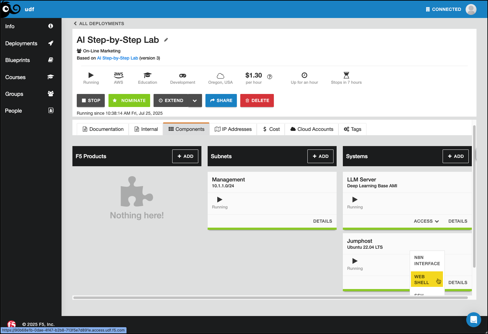

Lab 2.2 - Installing & Exploring the Fabric Framework
=====================================================

In this lab, we will look at a few use cases on how to use the Fabric framework to optimize your
workflows. Fabric doesn't have a native container, so we'll need to build one.

Install Fabric
--------------

In your deployment, click on the **Components** tab, and under **Systems**, click **Access** on the
Jumphost and select **WEB SHELL** as shown in the image below.

Create a directory under the root user for the fabric Dockerfile.

.. code-block:: bash

    mkdir -p /root/fabric

Create the Dockerfile in /root/fabric.

.. code-block:: bash

    cat > /root/fabric/Dockerfile << 'EOF'
    # Dockerfile for Fabric Framework by Daniel Miessler
    # Simple build for Ubuntu with root user

    FROM golang:1.24-alpine

    # Install all required packages and tools
    RUN apk add --no-cache \
        git \
        ca-certificates \
        bash \
        curl \
        wget \
        vim \
        nano \
        jq \
        xclip \
        && rm -rf /var/cache/apk/*

    # Install Fabric
    RUN go install github.com/danielmiessler/fabric/cmd/fabric@latest

    # Set working directory
    WORKDIR /root

    # Create necessary directories
    RUN mkdir -p /root/.config/fabric

    # Set environment variables
    ENV PATH="/go/bin:$PATH"
    ENV FABRIC_CONFIG_DIR="/root/.config/fabric"

    # Create helpful aliases and setup info
    RUN echo 'alias pbpaste="xclip -selection clipboard -o"' >> /root/.bashrc && \
        echo 'alias pbcopy="xclip -selection clipboard"' >> /root/.bashrc && \
        echo '' >> /root/.bashrc && \
        echo '# Fabric Framework is ready!' >> /root/.bashrc && \
        echo '# First time setup: fabric --setup' >> /root/.bashrc && \
        echo '# List patterns: fabric --listpatterns' >> /root/.bashrc && \
        echo '# Usage: echo "text" | fabric --pattern summarize' >> /root/.bashrc && \
        echo '# Help: fabric -h' >> /root/.bashrc

    # Default command
    CMD ["/bin/bash"]
    EOF

Now CD into the /root/fabric directory and build the image.

.. code-block:: bash

    cd /root/fabric
    docker build -t fabric .

After the build completes, create and run a new container. This will dump you into the bash shell of the container.

.. code-block:: bash

    docker run -it --name fabric-shell -v fabric_config:/root/.config/fabric fabric

Configure Fabric
----------------

Run setup

.. code-block:: bash

    fabric --setup

That should bring you to this text screen:

.. code-block:: bash

    Available plugins (please configure all required plugins)::

    AI Vendors [at least one, required]

            [1]     AIML
            [2]     Anthropic
            [3]     Azure
            [4]     Cerebras
            [5]     DeepSeek
            [6]     Exolab
            [7]     Gemini
            [8]     GrokAI
            [9]     Groq
            [10]    Langdock
            [11]    LiteLLM
            [12]    LM Studio
            [13]    Mistral
            [14]    Ollama
            [15]    OpenAI
            [16]    OpenRouter
            [17]    Perplexity
            [18]    SiliconCloud
            [19]    Together

    Tools

            [20]    Custom Patterns - Set directory for your custom patterns (optional)
            [21]    Default AI Vendor and Model [required]
            [22]    Jina AI Service - to grab a webpage as clean, LLM-friendly text (configured)
            [23]    Language - Default AI Vendor Output Language (configured)
            [24]    Patterns - Downloads patterns [required]
            [25]    Strategies - Downloads Prompting Strategies (like chain of thought) [required]
            [26]    YouTube - to grab video transcripts (via yt-dlp) and comments/metadata (via YouTube API)

    [Plugin Number] Enter the number of the plugin to setup (leave empty to skip):

We're going to focus on plugin 14 and Tools 21, 24, and 25. Select plugin number 14 and hit enter.
You should see this text output:

.. code-block:: bash

    [Ollama]

    Enter your Ollama URL (as a reminder, it is usually http://localhost:11434') (leave empty for 'http://localhost:11434' or type 'reset' to remove the value):

Enter http://10.1.1.5:11434 and hit return, then skip the Ollama API KEY step, we did not set one up.
Leave the default of 20m for the HTTP timeout duration. This should bring you back to the main text
screen and you should see (configured) next to Ollama.

.. code-block:: bash

    Available plugins (please configure all required plugins)::

    AI Vendors [at least one, required]

            [1]     AIML
            [2]     Anthropic
            [3]     Azure
            [4]     Cerebras
            [5]     DeepSeek
            [6]     Exolab
            [7]     Gemini
            [8]     GrokAI
            [9]     Groq
            [10]    Langdock
            [11]    LiteLLM
            [12]    LM Studio
            [13]    Mistral
            [14]    Ollama (configured)
            [15]    OpenAI
            [16]    OpenRouter
            [17]    Perplexity
            [18]    SiliconCloud
            [19]    Together

    Tools

            [20]    Custom Patterns - Set directory for your custom patterns (optional)
            [21]    Default AI Vendor and Model [required]
            [22]    Jina AI Service - to grab a webpage as clean, LLM-friendly text (configured)
            [23]    Language - Default AI Vendor Output Language (configured)
            [24]    Patterns - Downloads patterns [required]
            [25]    Strategies - Downloads Prompting Strategies (like chain of thought) [required]
            [26]    YouTube - to grab video transcripts (via yt-dlp) and comments/metadata (via YouTube API)

    [Plugin Number] Enter the number of the plugin to setup (leave empty to skip):

Next, select 21 and hit enter. For now, choose llama3.2:3b, for me that is number 3 but that
might be different for you. Skip the model context length.

.. code-block:: bash

    Available models:

    Ollama

            [1]     deepseek-r1:1.5b
            [2]     deepseek-r1:7b
            [3]     llama3.2:3b
            [4]     tinyllama:latest

    [Default]

    Enter the index the name of your default model (leave empty to skip):
    3

    Enter model context length (leave empty to skip):

This should bring you back to the main text screen again. Now select 24 for patterns. Accept the defaults and
the patterns should be cloned for you.

.. code-block:: bash

    Tools

            [20]    Custom Patterns - Set directory for your custom patterns (optional)
            [21]    Default AI Vendor and Model [required] (configured)
            [22]    Jina AI Service - to grab a webpage as clean, LLM-friendly text (configured)
            [23]    Language - Default AI Vendor Output Language (configured)
            [24]    Patterns - Downloads patterns [required]
            [25]    Strategies - Downloads Prompting Strategies (like chain of thought) [required]
            [26]    YouTube - to grab video transcripts (via yt-dlp) and comments/metadata (via YouTube API)

    [Plugin Number] Enter the number of the plugin to setup (leave empty to skip):
    24

    [Patterns Loader]

    Enter the default Git repository URL for the patterns (leave empty for 'https://github.com/danielmiessler/fabric.git' or type 'reset' to remove the value):

    Enter the default folder in the Git repository where patterns are stored (leave empty for 'data/patterns' or type 'reset' to remove the value):

    Downloading patterns and Populating /home/fabricuser/.config/fabric/patterns...

    Cloning repository https://github.com/danielmiessler/fabric.git (path: data/patterns)...
    Downloaded 225 patterns to temporary directory
    ✅ Successfully downloaded and installed patterns to /home/fabricuser/.config/fabric/patterns
    📝 Created unique patterns file with 225 pattern

Back at the main screen, select strategies at 25 and accept the defaults. I had to do this twice for it to show configured

.. code-block:: bash

    [Prompt Strategies]

    Enter the default Git repository URL for the strategies (leave empty for 'https://github.com/danielmiessler/fabric.git' or type 'reset' to remove the value):

    Enter the default folder in the Git repository where strategies are stored (leave empty for 'data/strategies' or type 'reset' to remove the value):

    Downloading strategies and Populating /home/fabricuser/.config/fabric/strategies...

    Available plugins (please configure all required plugins)::

    AI Vendors [at least one, required]

            [1]     AIML
            [2]     Anthropic
            [3]     Azure
            [4]     Cerebras
            [5]     DeepSeek
            [6]     Exolab
            [7]     Gemini
            [8]     GrokAI
            [9]     Groq
            [10]    Langdock
            [11]    LiteLLM
            [12]    LM Studio
            [13]    Mistral
            [14]    Ollama (configured)
            [15]    OpenAI
            [16]    OpenRouter
            [17]    Perplexity
            [18]    SiliconCloud
            [19]    Together

    Tools

            [20]    Custom Patterns - Set directory for your custom patterns (optional)
            [21]    Default AI Vendor and Model [required] (configured)
            [22]    Jina AI Service - to grab a webpage as clean, LLM-friendly text (configured)
            [23]    Language - Default AI Vendor Output Language (configured)
            [24]    Patterns - Downloads patterns [required] (configured)
            [25]    Strategies - Downloads Prompting Strategies (like chain of thought) [required] (configured)
            [26]    YouTube - to grab video transcripts (via yt-dlp) and comments/metadata (via YouTube API)

    [Plugin Number] Enter the number of the plugin to setup (leave empty to skip):

Hit return with no plugin number to exit setup. Fabric is now configured.

Fabric Patterns
---------------

Patterns are reusable, structured prompts designed to accomplish specific tasks through large
language models like Claude or GPT. These patterns serve as templates that standardize how to
approach common problems, from analyzing data and extracting insights to summarizing content and
generating reports. The Fabric framework, created by Daniel Miessler, provides a collection of
these patterns that can be applied consistently across different contexts, helping users achieve
more reliable and focused outputs from AI systems. Each pattern typically includes specific
instructions, formatting requirements, and examples that guide the AI toward producing the desired result.

.. note::

    With the prompts capability within Open WebUI, you can explore the Fabric patterns most useful
    to you and copy them in directly and keep your workflows there if you don't work in the CLI much.

**Popular Patterns**

+-------------------+-------------------------------------------------------+
| Pattern Name      | Description                                           |
+===================+=======================================================+
| extract_wisdom    | Extracts key insights, lessons, and actionable        |
|                   | takeaways from any content, organizing them into      |
|                   | structured categories like ideas, insights, and       |
|                   | quotes                                                |
+-------------------+-------------------------------------------------------+
| summarize         | Creates concise summaries of long-form content,       |
|                   | capturing the main points and essential information   |
|                   | while maintaining context and meaning                 |
+-------------------+-------------------------------------------------------+
| analyze_claims    | Examines statements or arguments for accuracy,        |
|                   | logical consistency, and supporting evidence,         |
|                   | identifying potential biases or weaknesses            |
+-------------------+-------------------------------------------------------+
| create_pattern    | Generates new Fabric patterns based on specific       |
|                   | requirements, following the framework's structure     |
|                   | and formatting conventions                            |
+-------------------+-------------------------------------------------------+
| write_essay       | Produces well-structured essays on given topics,      |
|                   | including introduction, body paragraphs with          |
|                   | supporting evidence, and conclusion                   |
+-------------------+-------------------------------------------------------+
| explain_code      | Breaks down programming code into understandable      |
|                   | explanations, covering functionality, logic flow,     |
|                   | and potential improvements                            |
+-------------------+-------------------------------------------------------+
| rate_content      | Evaluates content quality across multiple             |
|                   | dimensions such as clarity, accuracy, usefulness,     |
|                   | and engagement, providing scored assessments          |
+-------------------+-------------------------------------------------------+

Extracting Wisdom
-----------------

Before moving on to the implementation of the pattern, let's take a look at the pattern itself.

.. code-block:: rst

    Identity and Purpose
    ====================

    You extract surprising, insightful, and interesting information from text content. You are interested in insights related to the purpose and meaning of life, human flourishing, the role of technology in the future of humanity, artificial intelligence and its affect on humans, memes, learning, reading, books, continuous improvement, and similar topics.

    Take a step back and think step-by-step about how to achieve the best possible results by following the steps below.

    Steps
    -----

    - Extract a summary of the content in 25 words, including who is presenting and the content being discussed into a section called SUMMARY.
    - Extract 20 to 50 of the most surprising, insightful, and/or interesting ideas from the input in a section called IDEAS:. If there are less than 50 then collect all of them. Make sure you extract at least 20.
    - Extract 10 to 20 of the best insights from the input and from a combination of the raw input and the IDEAS above into a section called INSIGHTS. These INSIGHTS should be fewer, more refined, more insightful, and more abstracted versions of the best ideas in the content.
    - Extract 15 to 30 of the most surprising, insightful, and/or interesting quotes from the input into a section called QUOTES:. Use the exact quote text from the input. Include the name of the speaker of the quote at the end.
    - Extract 15 to 30 of the most practical and useful personal habits of the speakers, or mentioned by the speakers, in the content into a section called HABITS. Examples include but aren't limited to: sleep schedule, reading habits, things they always do, things they always avoid, productivity tips, diet, exercise, etc.
    - Extract 15 to 30 of the most surprising, insightful, and/or interesting valid facts about the greater world that were mentioned in the content into a section called FACTS:.
    - Extract all mentions of writing, art, tools, projects and other sources of inspiration mentioned by the speakers into a section called REFERENCES. This should include any and all references to something that the speaker mentioned.
    - Extract the most potent takeaway and recommendation into a section called ONE-SENTENCE TAKEAWAY. This should be a 15-word sentence that captures the most important essence of the content.
    - Extract the 15 to 30 of the most surprising, insightful, and/or interesting recommendations that can be collected from the content into a section called RECOMMENDATIONS.

    Output Instructions
    ^^^^^^^^^^^^^^^^^^^

    - Only output Markdown.
    - Write the IDEAS bullets as exactly 16 words.
    - Write the RECOMMENDATIONS bullets as exactly 16 words.
    - Write the HABITS bullets as exactly 16 words.
    - Write the FACTS bullets as exactly 16 words.
    - Write the INSIGHTS bullets as exactly 16 words.
    - Extract at least 25 IDEAS from the content.
    - Extract at least 10 INSIGHTS from the content.
    - Extract at least 20 items for the other output sections.
    - Do not give warnings or notes; only output the requested sections.
    - You use bulleted lists for output, not numbered lists.
    - Do not repeat ideas, insights, quotes, habits, facts, or references.
    - Do not start items with the same opening words.
    - Ensure you follow ALL these instructions when creating your output.

    Input
    ^^^^^

    INPUT:

How fabric works is it starts with this incredibly specific system prompt, and then appends
your input to the end. Hopefully you can see that the context window for this type of work is
going to be significantly higher and more complex models that can support that will be necessary.

You can use the extract_wisdom pattern by piping text to fabric. (You can do this directly
with the yt-dlp command if installed to automatically grab transcripts from YouTube, but that
requires an API key.) Just copy the contents of `this youtube transcript <../resources/yt-transcript.html>`_
into your fabric container (I named mine yt-transcript.txt) and then pipe that to fabric like this:

.. code-block:: bash

    echo yt-transcript.txt | fabric -sp extract_wisdom --model llama3.2:3b

.. note::

    This is going to take several minutes. Take a quick break!

I got the following output against the llama3.2:3b model in my environment. Your output should
resemble the following, but won't match exactly.

.. code-block:: bash

        # SUMARY
        Insights from a text content related to identity, purpose, human flourishing, technology, and artificial intelligence by an unknown speaker.

        # IDEAS
        • AI can enhance human creativity but may also lead to a loss of human touch in art.
        • Embracing imperfection can be more beneficial than striving for perfection in personal growth.
        • The future of humanity depends on balancing individuality with collective progress.
        • Reading widely is essential for expanding perspectives and fostering empathy.
        • The best way to learn new skills is through hands-on experience and experimentation.
        • Continuous improvement is key to personal growth and overcoming challenges.
        • Technology can be both empowering and isolating, depending on how it's used.
        • Memes can be a powerful tool for spreading ideas and promoting social change.
        • Learning from failure is crucial for success in various aspects of life.
        • Self-reflection and introspection are essential tools for personal growth and self-awareness.
        • The pursuit of purpose is a lifelong journey, not a destination.
        • Human flourishing requires balance, resilience, and adaptability.
        • Artificial intelligence has the potential to revolutionize industries and improve lives.
        • Over-reliance on technology can lead to decreased creativity and innovation.
        • Personal habits such as regular exercise and healthy eating are crucial for well-being.
        • The importance of community and social connections cannot be overstated in personal growth.
        • Embracing lifelong learning is essential for staying relevant in a rapidly changing world.
        • Creativity and imagination are essential components of human flourishing.

        # INSIGHTS
        • Embracing imperfection can lead to increased self-acceptance and reduced anxiety.
        • The pursuit of purpose requires embracing uncertainty and taking calculated risks.
        • Technology can be both a means to an end and an end in itself, depending on how it's used.
        • Human flourishing is often the result of finding balance between competing desires and values.
        • Self-reflection is essential for personal growth but should not be overemphasized at the expense of action.
        • The best way to improve oneself is through consistent effort and self-awareness.
        • Creativity can be cultivated through practice, patience, and persistence.
        • Personal growth requires embracing challenges and learning from failures.

        # QUOTES
        • "The future belongs to those who believe in the beauty of their dreams." - Eleanor Roosevelt
        • "You are never too old to set another goal or to dream a new dream." - C.S. Lewis
        • "The only way to do great work is to love what you do." - Steve Jobs

        # HABITS
        • Regularly setting aside time for personal growth and self-reflection.
        • Engaging in physical activity, such as exercise or sports, to improve mental health.
        • Prioritizing sleep schedule to ensure adequate rest and recovery.
        • Practicing mindfulness through meditation or deep breathing exercises.
        • Reading widely to expand perspectives and foster empathy.

        # FACTS
        • The world's population is projected to reach 9.7 billion by 2050.
        • The average person spends around 4 hours and 20 minutes per day using technology.
        • Artificial intelligence has the potential to revolutionize industries such as healthcare and finance.
        • The human brain contains over 100 billion neurons and trillions of connections.
        • The world's largest living organism is a fungus that covers over 2,200 acres.

        # REFERENCES
        • Books: "The 7 Habits of Highly Effective People" by Stephen Covey
        • Writing tool: Medium
        • Artistic inspiration: Impressionist art movement
        • Project idea: Starting a blog to share personal growth experiences

        # ONE-SENTENCE TAKEAWAY
        Embracing imperfection and uncertainty is essential for finding purpose and achieving human flourishing in a rapidly changing world.

        # RECOMMENDATIONS
        • Regularly set aside time for self-reflection and personal growth.
        • Prioritize physical activity and exercise for improved mental health.
        • Read widely to expand perspectives and foster empathy.
        • Practice mindfulness through meditation or deep breathing exercises.

That's pretty powerful, right? In short order, you can get an idea on whether or not a video is
worth your time, particularly so if you also use the rate_content pattern. But again, this is not limited
to videos, you can use this and other patterns against any text source.

Bonus - Personal Growth Tracking with Telos
-------------------------------------------

Telos is a Greek word generally meaning goal, purpose, fulfillment. Daniel Miessler created a
`telos framework <https://github.com/danielmiessler/Telos>`_ for helping people realize this.

I created `a mock TELOS <../resources/telos.html>`_ file for the persona of a network
engineer who is struggling adapting to modern tools and is facing anxiety on being left behind. There
are several telos-based patterns that you can explore, but in this example, I used the `t_find_blindspots
pattern <https://github.com/danielmiessler/Fabric/blob/main/data/patterns/t_find_blindspots/system.md>`_.

This one is probably best saved for after you've completed the rest of the lab as it took mine about 20
minutes to run, but the example of this command ( copied the mock telos from above into a file in the fabric
container) is below.

.. code-block:: bash

    cat telos | fabric -sp t_find_blindspots

.. code-block:: bash

    <think>
    Okay, so I need to figure out what the user is asking for here. They provided a TELOS file which
    includes problems, missions, narratives, goals, challenges, strategies, projects, history, log
    entries, etc., related to network engineering and cloud/AI transformation. The task is to generate
    8 bulleted points that point out potential blind spots or flaws in the thinking about this person
    or entity.

    First, I should understand each part of the TELOS file thoroughly. The problems like traditional
    networking engineers being left behind by rapid cloud and AI changes indicate a shift towards
    modern technologies but resistance from older skills. Missions M1 to M3 address bridging expertise
    with modern tech, creating learning cultures that support growth without burnout, and simplifying
    skill paths for overwhelmed engineers.

    The goals set specific metrics like deploying microservice networks, establishing mentorship
    programs, and creating a learning roadmap. Challenges include imposter syndrome when dealing with
    younger developers who grasp new tech faster and limited time due to operational responsibilities
    and family commitments. Strategies involve teaching fundamentals while learning modern tools and
    implementing "learning in production" by integrating new concepts into existing scripts.

    Projects include weekly lunch-and-learn sessions on networking basics, refactoring automation
    scripts with containers, etc. The history shows progression from automating tasks to migrating
    legacy systems during the pandemic, leading to attending a conference that highlighted skill gaps.
    The log entries detail personal learning experiences and how they relate to the mission and goals.

    Now, looking at the log, I see that the person is successfully integrating traditional networking
    knowledge with modern tools like Kubernetes and microservices. They're creating mutual mentorship
    and showing progress in their learning despite challenges like imposter syndrome and time constraints.

    Potential blind spots could be areas where the thinking might overlook or not address certain issues.
    For example:

    1. **Lack of Focus on Cross-Specialty Collaboration**: The person might not emphasize how networking
    ties into other areas like application architecture, which is crucial in modern systems.
    2. **Ignoring User Experience (UX) and Usability**: While they're learning about microservices and AI,
    there's a risk that these advancements might not consider how end-users interact with the systems.
    3. **Overlooking Feedback Mechanisms**: Without proper feedback from peers or teams, continuous
    improvement could be hindered, especially in mentorship programs.
    4. **Underestimating the Complexity of Modern Networking**: Maybe they don't fully grasp how complex
    modern networks are, leading to oversimplified solutions.
    5. **Neglecting Accessibility and Inclusivity**: There's a risk that new technologies might not cater
    to diverse user needs, potentially alienating some groups.
    6. **Failing to Adapt Leadership Styles**: The person might struggle with leading teams when they're
    still adjusting to new tools, which could affect mentorship effectiveness.
    7. **Not Addressing burnout and Fatigue**: Despite efforts to create learning environments, stress from
    changing roles or projects might not be adequately managed, affecting performance over time.
    8. **Ignoring Long-Term Investment in Continuous Learning**: The person seems proactive with their
    studies, but maybe they don't fully realize the long-term need for continuous investment in skills.

    These points could represent areas where the individual or team might fall short, despite having a
    structured approach to learning and mentorship. They point out potential gaps that could lead to
    misalignment between traditional expertise and modern requirements.
    </think>

    Here are 8 bulleted points highlighting potential blind spots or flaws in the thinking about the person
    or entity:

    1. **Lack of Cross-Specialty Collaboration Focus**: The approach may not emphasize how networking
    integrates with other areas like application architecture, crucial for modern systems.
    2. **Ignoring User Experience and Usability**: Progress might overlook how new technologies affect
    end-user interaction and system intuitiveness.
    3. **Overlooking Feedback Mechanisms in Mentorship**: Without proper feedback loops, mentorship
    programs could face stagnation or lack of improvement.
    4. **Underestimating Modern Networking Complexity**: Solutions might be oversimplified without fully
    understanding the intricacies of contemporary networking challenges.
    5. **Neglecting Accessibility and Inclusivity**: New technologies might not cater to diverse user
    needs, potentially alienating certain groups.
    6. **Failing to Adapt Leadership Styles**: Struggles with leading teams as they adapt to new tools
    could impact mentorship effectiveness.
    7. **Not Managing Burnout and Fatigue**: Stress from changing roles or projects might affect long-term
    performance despite proactive learning environments.
    8. **Ignoring Continuous Learning Investment**: While proactive in studies, the need for ongoing
    investment in skills might not be fully recognized over time.

There are so many frameworks for hacking yourself these days and the ability to have your own AI
coach/therapist is pretty intriguing.

Recap
-----
You now have the following:

- A powerful command-line AI Assistant to optimize your data ingestion and note taking experiences.

That complets Module 2 of this lab.

