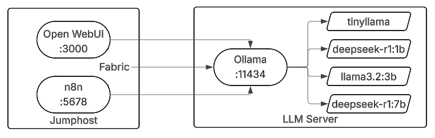

Module 2: LLM Tools - Open WebUI, Fabric
========================================

Now that we have our LLMs up and running, let's integrate a graphical front-end with
Open WebUI and use the cli-based Fabric framework to optimize some workflows. Details
of each tool we'll take a look at are below.

Open WebUI
----------

Open WebUI is a feature-rich, self-hostable web interface designed to work with various
language models and AI services, most commonly used as a frontend for Ollama and
OpenAI-compatible APIs. It provides a ChatGPT-like conversational interface that runs
entirely on your own infrastructure, giving you full control over your data and
conversations while supporting multiple users, authentication, and administrative features.

Practical Usage
~~~~~~~~~~~~~~~

Aside from the learning aspect of this, you could look at using this as a method to make AI
services available to your household. There are interesting benefits this way:

* Save money from subscribing to AI chat services by consolidating individual family members
  subscriptions. It is likely that using an AI service's API will be far cheaper than a single
  subscription, let alone if you have mutiple people in your household using services.
* Keep an eye on what your kids are doing with AI with the ability to monitor their chats.
* Experiment with the latest models quickly as you can switch models quickly. As well, services
  like OpenAI typically will have their latest models available via API before their general
  subscription service.

Fabric
------

Daniel Miessler's Fabric is a powerful open-source framework designed to augment human
intelligence by integrating AI into everyday workflows through a collection of modular,
purpose-built AI "patterns." Rather than being just another AI chat interface, Fabric focuses on
creating standardized, reusable prompts and workflows that solve specific problems across domains
like security analysis, content creation, code review, research, and personal productivity.

Lab Architecture
----------------

Now that we've expanded beyond the single instance from Module 1, let's look at how the connectivity
works between our Jumphost and the LLM Server. This is what you'll be setting up in Modules 2 & 3.

.. toctree::
   :maxdepth: 1
   :glob:

   lab*
