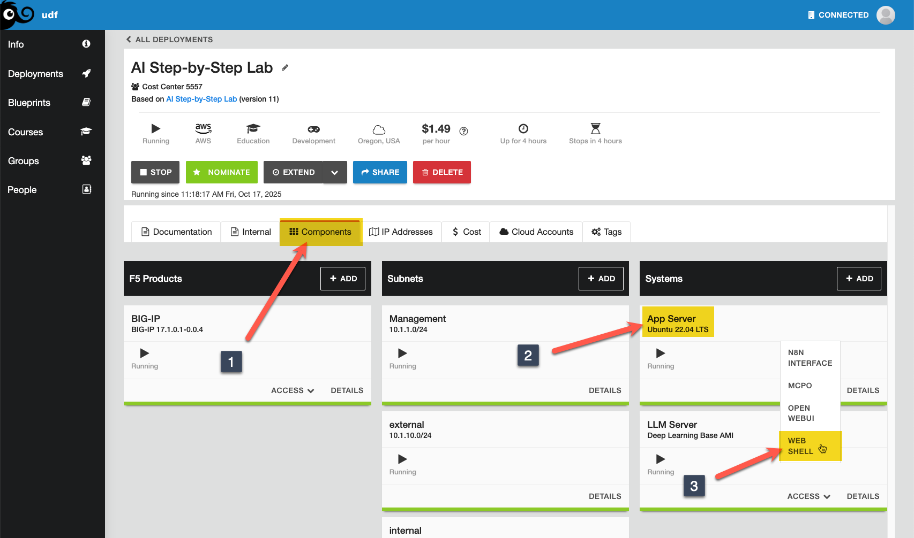

Lab 3.1 - Installing n8n
========================

n8n is a free and open fair-code licensed node based workflow automation tool that will allow you to easily create AI agents for use with LLMs out of the box.
It is very easy to get started with and does not require a GPU. In this module, we will install n8n in a docker container on our **App Server** and run it, then
verify we can access it via web UI. You will want to open the **WEB SHELL**.

Installing n8n
--------------
1. Change directory into /root/n8n (and review the compose file, right? RIGHT?!?) and start up your compose service.

.. code-block:: console

    cd /root/n8n
    docker compose up -d

You should see output similar to the following since we pre-loaded the images/containers:

.. code-block:: console

    root@ip-10-1-1-4:/root/n8n# docker compose up -d
    [+] Running 1/1
     ✔ Container n8n  Started

If this were the first time, the output would be more similar to this:

.. code-block:: console

    root@ip-10-1-1-4:/# cd /root/n8n
    root@ip-10-1-1-4:/root/n8n# docker compose up -d
    [+] Running 13/13
     ✔ n8n Pulled                                                                                                                                                                        63.9s
       ✔ 2d35ebdb57d9 Already exists                                                                                                                                                      0.0s
       ✔ 2f385331c129 Pull complete                                                                                                                                                       5.7s
       ✔ b6cd7e47c1da Pull complete                                                                                                                                                       5.8s
       ✔ 44a43d49c511 Pull complete                                                                                                                                                       5.8s
       ✔ 586f3a742593 Pull complete                                                                                                                                                       7.0s
       ✔ 4f4fb700ef54 Pull complete                                                                                                                                                       7.0s
       ✔ 056ebdca45ee Pull complete                                                                                                                                                      61.7s
       ✔ f1777faed328 Pull complete                                                                                                                                                      61.8s
       ✔ da9f1bd4a075 Pull complete                                                                                                                                                      61.8s
       ✔ 67220c627675 Pull complete                                                                                                                                                      61.9s
       ✔ acde3a17a713 Pull complete                                                                                                                                                      62.2s
       ✔ 4b7cc13c92b9 Pull complete                                                                                                                                                      62.7s
    [+] Running 2/2
     ✔ Volume "n8n_n8n_data"  Created                                                                                                                                                     0.0s
     ✔ Container n8n          Started

2. Check to make sure the container is up.

.. code-block:: console

    docker ps

The output should resemble the following:

.. code-block:: console

    root@ip-10-1-1-4:/# docker ps | grep n8n$
    847967562ba2   docker.n8n.io/n8nio/n8n              "tini -- /docker-ent…"   4 minutes ago   Up 4 minutes           0.0.0.0:5678->5678/tcp, [::]:5678->5678/tcp   n8n

At this point, n8n is ready for your first action!

Proceed to the next lab to start setting up your first AI agent.
