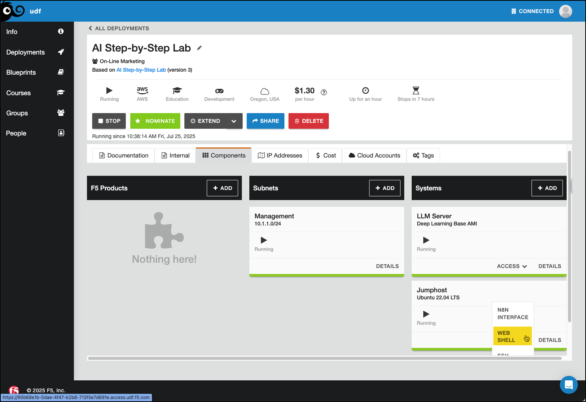

Lab 3.1 - Installing n8n
========================

n8n is a free and open fair-code licensed node based workflow automation tool that will allow you to easily create AI agents for use with LLMs out of the box.
It is very easy to get started with and does not require a GPU. In this module, we will install n8n in a docker container on our **Jumphost** and run it, then
verify we can access it via web UI. You will want to open the **WEB SHELL** from the Jumphost.

Installing n8n
--------------
1. First, we need to create a Docker volume for the n8n data to live on.

.. code-block:: bash

	docker volume create n8n_data

This should give you a persistent volume to keep your n8n workflows intact, even if you need to restart your container for some reason.

2. Next, we will issue a single docker command to download the latest n8n container, set the host networking ports, connect to your n8n_data volume and run it.

.. code-block:: bash

	docker run -it --rm --name n8n -p 5678:5678 -v n8n_data:/home/node/.n8n docker.n8n.io/n8nio/n8n

You should see output similar to the following:

.. code-block:: bash

    root@ip-10-1-1-4:/# docker run -it --rm --name n8n -p 5678:5678 -v n8n_data:/home/node/.n8n docker.n8n.io/n8nio/n8n
	Unable to find image 'docker.n8n.io/n8nio/n8n:latest' locally
	latest: Pulling from n8nio/n8n
	fe07684b16b8: Pull complete 
	49b72e7e39fe: Pull complete 
	c1ab3b052759: Pull complete 
	845179b1d451: Pull complete 
	ad03744990d9: Pull complete 
	4f4fb700ef54: Pull complete
	``<REDACTED FOR LENGTH>``
	Starting migration AddProjectDescriptionColumn1747824239000
	Finished migration AddProjectDescriptionColumn1747824239000
	Starting migration AddLastActiveAtColumnToUser1750252139166
	Finished migration AddLastActiveAtColumnToUser1750252139166

	There is a deprecation related to your environment variables. Please take the recommended actions to update your configuration:
	- N8N_RUNNERS_ENABLED -> Running n8n without task runners is deprecated. Task runners will be turned on by default in a future version. Please set `N8N_RUNNERS_ENABLED=true` to enable task runners now and avoid potential issues in the future. Learn more: https://docs.n8n.io/hosting/configuration/task-runners/

	[license SDK] Skipping renewal on init because renewal is not due yet or cert is not initialized
	Version: 1.104.1

	Editor is now accessible via:
	http://localhost:5678

	Press "o" to open in Browser.

At this point, n8n should be running and ready for your first access!

Proceed to the next lab to start setting up your first AI agent.
