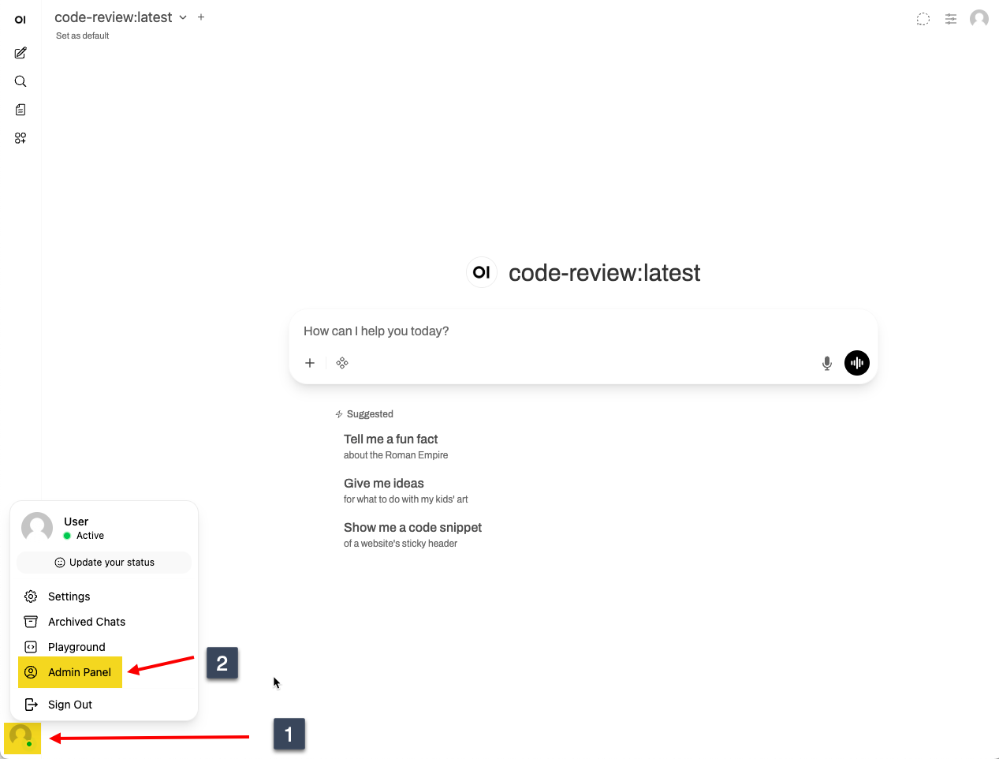
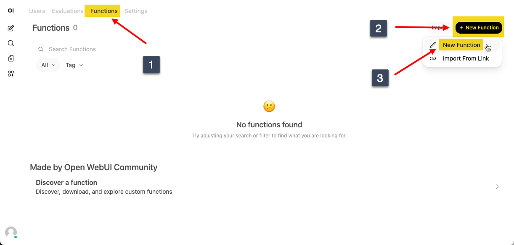
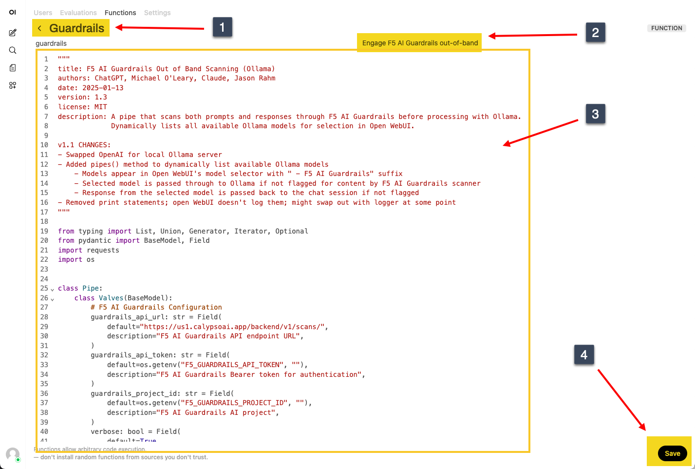
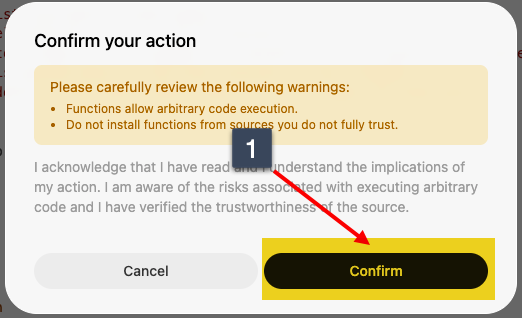
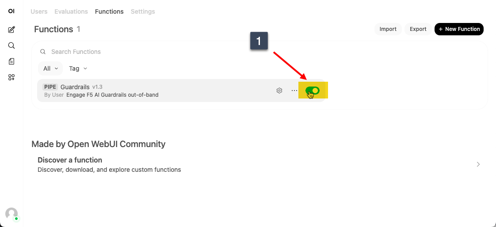
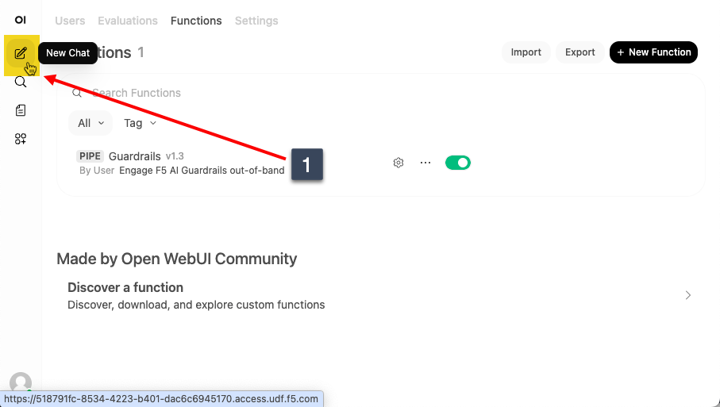
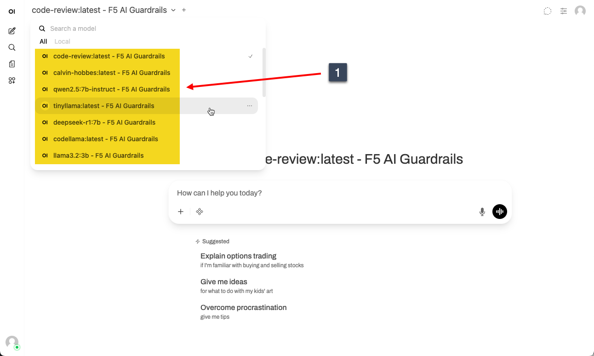

Lab 4.1 - Activating F5 AI Guardrails
=====================================

Functions in Open WebUI are Python-based extensions that let you add custom capabilities to your chat interface.
They can call external APIs, process data, integrate third-party services, or automate tasks—turning your chat into a
customizable workspace. Use them to fetch real-time information, connect to databases, or build interactive tools that
fit your specific workflow.

In our case, we're going to use a function to a) insert F5 AI Guardrails into the selectable models and b) call the API
when a prompt is submitted in Open WebUI. If the scan of the prompt passes, the prompt will be passed along to the local
models you've used in the previous labs. When those models respond, the response will also be sent to the API and scanned,
and if that scan is successful, you'll get the model's response displayed in your chat window. Otherwise, at either the
prompt or the response, you'll get a block message from the scanner.

Create a function in Open WebUI
-------------------------------

1. Access your Open WebUI interface again. Go to your deployment, click on the **Components** tab, and under **Systems**,
click **Access** on the **App Server** and select **OPEN WEBUI** as shown in the image below.

.. image:: ../module2/images/01_openwebui_access.png

If that isn't working, you might need to go back to your webshell for the App Server and check to see if the open-webui
container is healthy by running **docker ps**. If it is not healthy, try **docker compose restart** in that
/root/open-webui folder.

2. In the bottom left corner of the Open WebUI screen, click the profile icon and then click the admin panel

3. On the top menu, click Functions, then at the right, click + New Function.

4. In the new window, name the function Guardrails and give it a description, then remove the template code and paste
in the python code below this next image and save the function.

.. code-block:: python

    """
    title: F5 AI Guardrails Out of Band Scanning (Ollama)
    authors: ChatGPT, Michael O'Leary, Claude, Jason Rahm
    date: 2025-01-26
    version: 1.3
    license: MIT
    description: A pipe that scans both prompts and responses through F5 AI Guardrails before processing with Ollama.
                 Dynamically lists all available Ollama models for selection in Open WebUI.

    v1.1 CHANGES:
    - Swapped OpenAI for local Ollama server
    - Added pipes() method to dynamically list available Ollama models
        - Models appear in Open WebUI's model selector with " - F5 AI Guardrails" suffix
        - Selected model is passed through to Ollama if not flagged for content by F5 AI Guardrails scanner
        - Response from the selected model is passed back to the chat session if not flagged
    - Removed print statements; open WebUI doesn't log them; might swap out with logger at some point
    """

    from typing import List, Union, Generator, Iterator, Optional
    from pydantic import BaseModel, Field
    import requests
    import os

    class Pipe:
        class Valves(BaseModel):
            # F5 AI Guardrails Configuration
            guardrails_api_url: str = Field(
                default="https://us1.calypsoai.app/backend/v1/scans/",
                description="F5 AI Guardrails API endpoint URL",
            )
            guardrails_api_token: str = Field(
                default=os.getenv("F5_GUARDRAILS_API_TOKEN", ""),
                description="F5 AI Guardrails Bearer token for authentication",
            )
            guardrails_project_id: str = Field(
                default=os.getenv("F5_GUARDRAILS_PROJECT_ID", ""),
                description="F5 AI Guardrails AI project",
            )
            verbose: bool = Field(
                default=True,
                description="Enable verbose mode for F5 AI Guardrails scans",
            )
            scan_input: bool = Field(
                default=True,
                description="Scan user input prompts",
            )
            scan_output: bool = Field(
                default=True,
                description="Scan LLM responses",
            )

            # Ollama Configuration
            ollama_api_base: str = Field(
                default="http://10.1.1.5:11434/v1",  # Open WebUI is running in Docker but Ollama is not on my MacOS (for GPU access)
                description="Ollama API base URL (OpenAI-compatible endpoint)",
            )
            ollama_host: str = Field(
                default="http://10.1.1.5:11434",  # Base URL for native Ollama API
                description="Ollama host URL (for listing models)",
            )
            ollama_api_key: str = Field(
                default="ollama",  # Placeholder - Ollama doesn't require auth
                description="API key placeholder (Ollama doesn't require authentication)",
            )

        def __init__(self):
            self.type = "manifold"  # STEP 2: Changed from "pipe" to "manifold" to support multiple models
            self.name = ""  # This becomes the prefix in the model list (don't want ta prepend...setting to empty)
            self.valves = self.Valves()

        def pipes(self) -> List[dict]:
            """
            STEP 2: Return list of available Ollama models.
            This method is called by Open WebUI to populate the model selector.
            Each model will appear as "{self.name}: {model_name}" in the dropdown.
            """

            try:
                # Query Ollama's native API for available models
                response = requests.get(
                    f"{self.valves.ollama_host}/api/tags",
                    timeout=5,
                )
                response.raise_for_status()

                models_data = response.json()
                models = models_data.get("models", [])

                # Build list of model definitions for Open WebUI
                available_models = []
                for model in models:
                    model_name = model.get("name", "")
                    if model_name:
                        available_models.append(
                            {
                                "id": model_name,  # This gets passed to pipe() as model_id
                                "name": f"{model_name} - F5 AI Guardrails",  # Display name (adding suffix for protection layer)
                            }
                        )

                if not available_models:
                    # Return a placeholder if no models found
                    return [
                        {
                            "id": "no-models",
                            "name": "No models found - run 'ollama pull <model>'",
                        }
                    ]

                return available_models

            except requests.RequestException as e:
                # Return error indicator so user knows something is wrong
                return [
                    {
                        "id": "error",
                        "name": f"Error connecting to Ollama: {str(e)[:50]}",
                    }
                ]

        def scan_content(self, content: str, scan_type: str = "request") -> dict:
            """Scan content with F5 AI Guardrails and return the result"""

            scan_payload = {
                "disabled": [],
                "forceEnabled": [],
                "input": content,
                "project": self.valves.guardrails_project_id,
                "verbose": self.valves.verbose,
            }

            headers = {
                "Authorization": f"Bearer {self.valves.guardrails_api_token}",
                "Content-Type": "application/json",
            }

            try:
                response = requests.post(
                    self.valves.guardrails_api_url,
                    json=scan_payload,
                    headers=headers,
                    timeout=10,
                )
                response.raise_for_status()
                return response.json()
            except requests.RequestException as e:
                raise Exception(f"Content scanning service error: {str(e)}")

        def get_error_message(self, scan_result: dict) -> str:
            """Extract error message from scan result"""
            failed_scanners = []
            scanner_results = scan_result.get("result", {}).get("scannerResults", [])
            scanners_info = scan_result.get("scanners", {}).get("scanners", {})
            configs = scan_result.get("scanners", {}).get("configs", {})

            for scanner_result in scanner_results:
                if scanner_result.get("outcome") == "failed":
                    scanner_id = scanner_result.get("scannerId")
                    scanner_name = scanners_info.get(scanner_id, {}).get("name", "Unknown")

                    # Get custom flag message if available
                    flag_message = configs.get(scanner_id, {}).get("flagMessage")

                    if flag_message:
                        return flag_message

                    failed_scanners.append(scanner_name)

            if failed_scanners:
                scanner_list = ", ".join(failed_scanners)
                return f"Content blocked by F5 AI Guardrails policy ({scanner_list}). Please rephrase and try again."

            return (
                "Content blocked by F5 AI Guardrails policy. Please rephrase and try again."
            )

        def pipe(
            self,
            user_message: str = "",
            model_id: str = "",  # STEP 2: This now receives the selected model from pipes()
            messages: List[dict] = None,
            body: dict = None,
        ) -> Union[str, Generator, Iterator]:
            if messages is None:
                messages = []
            if body is None:
                body = {}

            if not model_id and body:
                model_id = body.get("model", "")

            if model_id and "." in model_id:
                model_id = model_id.split(".", 1)[1]

            # STEP 2: Handle error/placeholder model selections
            if model_id in ["no-models", "error"]:
                return "Error: No Ollama models available. Please ensure Ollama is running and has models pulled."

            # Extract messages from body if not in messages parameter
            if not messages and body:
                messages = body.get("messages", [])

            if not messages:
                return "Error: No messages provided"

            # Get the user message from the messages array if not provided
            if not user_message:
                for msg in reversed(messages):
                    if msg.get("role") == "user":
                        user_message = msg.get("content", "")
                        break

            if not user_message:
                return "Error: No user message found"

            # Scan input if enabled
            if self.valves.scan_input and user_message:
                try:
                    input_scan = self.scan_content(user_message, "input")
                    input_outcome = input_scan.get("result", {}).get("outcome")

                    if input_outcome == "flagged":
                        error_msg = self.get_error_message(input_scan)
                        return error_msg

                except Exception as e:
                    return f"Error: {str(e)}"

            # Call the LLM using OpenAI-compatible API (works with Ollama)
            try:
                import openai

                api_key = self.valves.ollama_api_key or "ollama"
                api_base = self.valves.ollama_api_base

                # STEP 2: Use the model_id passed from the UI selection
                # The model_id comes from the pipes() method - it's the actual Ollama model name
                selected_model = (
                    model_id if model_id else "llama3.2"
                )  # Fallback if somehow empty

                client = openai.OpenAI(api_key=api_key, base_url=api_base)

                # Call the model
                completion = client.chat.completions.create(
                    model=selected_model,
                    messages=messages,
                    stream=False,  # Don't stream - we need the full response for scanning
                )

                full_response = completion.choices[0].message.content

                # Scan output if enabled
                if self.valves.scan_output and full_response:
                    try:
                        output_scan = self.scan_content(full_response, "output")
                        output_outcome = output_scan.get("result", {}).get("outcome")

                        if output_outcome == "flagged":
                            error_msg = self.get_error_message(output_scan)
                            return error_msg

                    except Exception as e:
                        return f"Error: {str(e)}"

                return full_response

            except ImportError as e:
                return "Error: openai library not available. Please install it."

            except openai.APIConnectionError as e:
                return (
                    f"Error: Cannot connect to Ollama at {self.valves.ollama_api_base}. "
                    "Please ensure Ollama is running ('ollama serve')."
                )

            except openai.NotFoundError as e:
                return (
                    f"Error: Model '{model_id}' not found in Ollama. "
                    "Please run 'ollama list' to see available models, or pull the model with "
                    f"'ollama pull {model_id}'."
                )

            except Exception as e:
                return f"Error generating response: {str(e)}"

5. Confirm the dialog that pops up.

6. Now activate the function.

7. Click new chat on the left menu.

8. If you click the models dropdown now, you should see a list of models with F5 AI Guardrails applied.

Congratulations! You now have guardrails applied against your local inferencing setup.

Recap
-----

In this lab, you activated F5 AI Guardrails out of band scanning capability through Open WebUI's functions features.

Click Next to continue to the next lab.