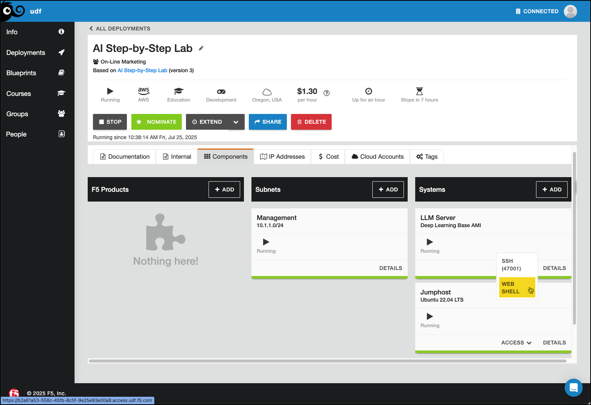

Lab 4.1 - Launch The AI Gateway Demo
====================================

Installation has already been completed on your behalf, but you need to get it running.
In your deployment, click on the **Components** tab, and under **Systems**, click **Access** on the
LLM Server and select **WEB SHELL** as shown in the image below. This will launch the shell which
you will use for the remainder of the labs in this module.

There is a name conflict with the Ollama server from Module 1 and the one that is embedded in this demo,
so we'll need to shut that one down and remove it before launching the AI Gateway demo.

.. code-block:: bash

    docker stop ollama
    docker rm ollama

Now, change your directory into the demo project folder.

.. code-block:: bash

    cd /root/f5-ai-gateway-demo

Run the docker compose and wait for it to instantiate.

.. code-block:: bash

    docker compose up -d

The output should resemble this:

.. code-block:: bash

    root@ip-10-1-1-5:/root/f5-ai-gateway-demo# docker compose up -d
    [+] Running 7/7
     ✔ Network f5-ai-gateway-demo_aigw   Created                                                                                                       0.0s
     ✔ Container ollama                  Started                                                                                                       0.6s
     ✔ Container open-webui-unprotected  Started                                                                                                       0.5s
     ✔ Container aigw-processors-f5      Healthy                                                                                                       8.6s
     ✔ Container open-webui-protected    Started                                                                                                       0.5s
     ✔ Container aigw-processors-demo    Started                                                                                                       0.5s
     ✔ Container aigw                    Started

It might take a couple minutes for the containers to fully load. You can check status with **docker ps**

.. code-block:: bash

    docker ps

The output should resemble this (once healthy):

.. code-block:: bash

    root@ip-10-1-1-5:/root/f5-ai-gateway-demo# docker ps
    CONTAINER ID   IMAGE                                                    COMMAND                  CREATED         STATUS                   PORTS                                                                                  NAMES
    83c0cd249932   private-registry.f5.com/aigw/aigw:v1.1.0                 "/aigw start /etc/ai…"   6 minutes ago   Up 6 minutes             0.0.0.0:8080->8080/tcp, [::]:8080->8080/tcp, 0.0.0.0:80->4141/tcp, [::]:80->4141/tcp   aigw
    c705a0e87af1   ghcr.io/open-webui/open-webui                            "bash start.sh"          6 minutes ago   Up 6 minutes (healthy)   0.0.0.0:9091->8080/tcp, [::]:9091->8080/tcp                                            open-webui-unprotected
    8b827563101a   ghcr.io/open-webui/open-webui                            "bash start.sh"          6 minutes ago   Up 6 minutes (healthy)   0.0.0.0:9090->8080/tcp, [::]:9090->8080/tcp                                            open-webui-protected
    d4a4e4329175   private-registry.f5.com/aigw/aigw-processors-f5:v1.1.0   "sh -c 'python -m gu…"   6 minutes ago   Up 6 minutes (healthy)   0.0.0.0:8000->8000/tcp, [::]:8000->8000/tcp                                            aigw-processors-f5
    7084ec52de67   megamattzilla/ai-gateway-sdk-demo:user-prompt-v1.0       "uvicorn user-prompt…"   6 minutes ago   Up 6 minutes             0.0.0.0:8042->8000/tcp, [::]:8042->8000/tcp                                            aigw-processors-demo
    a8ba461994cc   ollama/ollama:latest                                     "/bin/sh /model_file…"   6 minutes ago   Up 6 minutes             0.0.0.0:11434->11434/tcp, [::]:11434->11434/tcp                                        ollam

You can do a quick test to the front-end Open WebUI servers to make sure they're up. You don't need the grep,
but there's a lot of web code otherwise.

.. code-block:: bash

    curl -s http://localhost:9090 | grep \<title\>
    curl -s http://localhost:9091 | grep \<title\>

The output should resemble this:

.. code-block:: bash

    root@ip-10-1-1-5:/# curl -s http://localhost:9090 | grep \<title\>
                    <title>Open WebUI</title>
    root@ip-10-1-1-5:/# curl -s http://localhost:9091 | grep \<title\>
                    <title>Open WebUI</title>

Recap
-----
You now have the following:

- A working AI Gateway with an Ollama backend and two Open WebUI front-ends, protected and unprotected

Next we'll run some tests against both front-ends.
