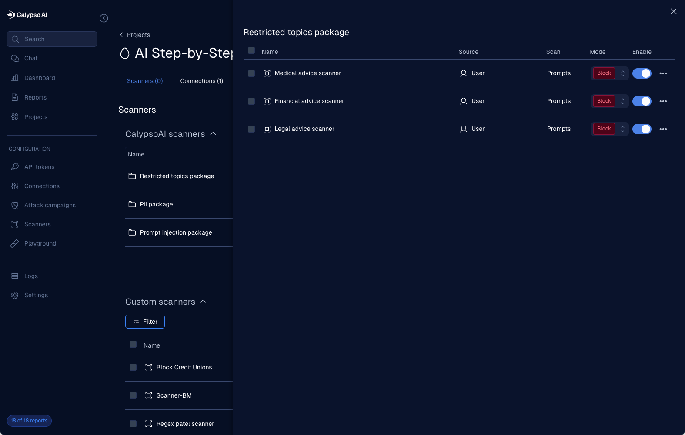
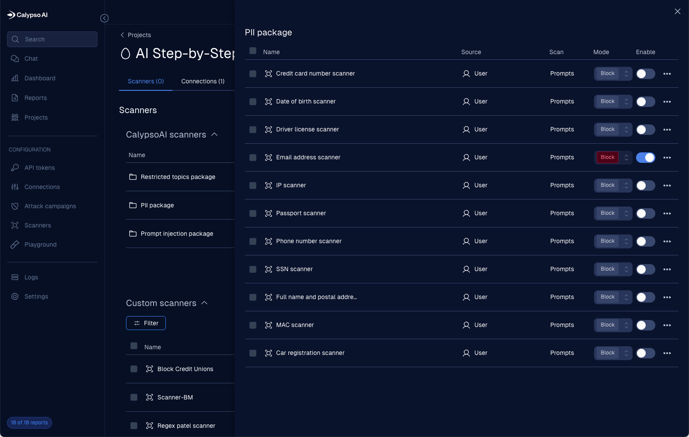
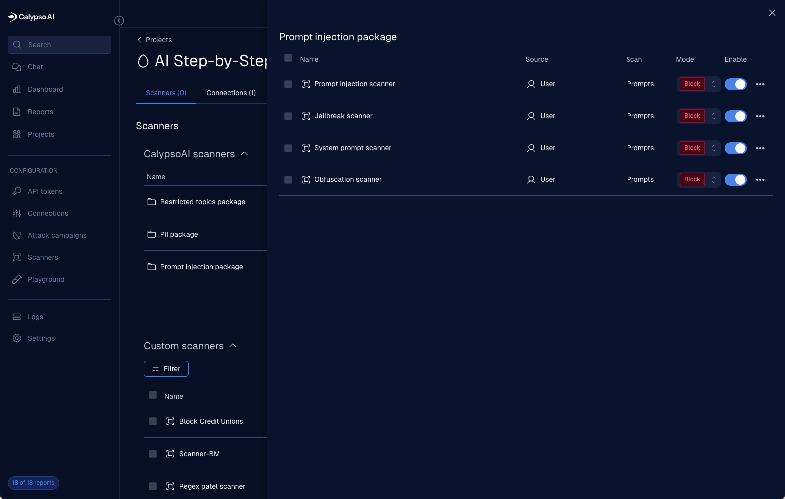
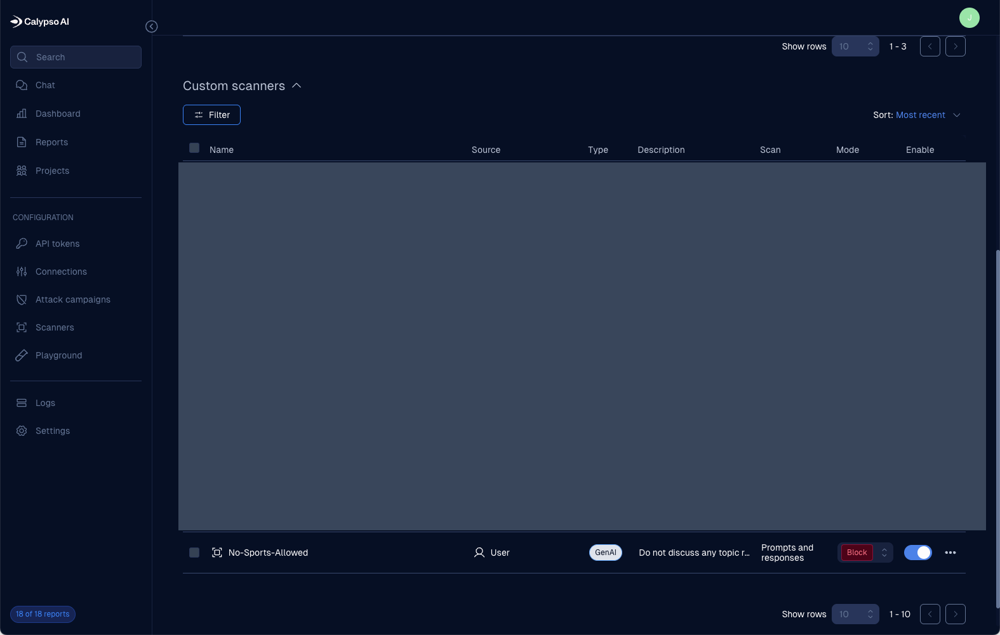
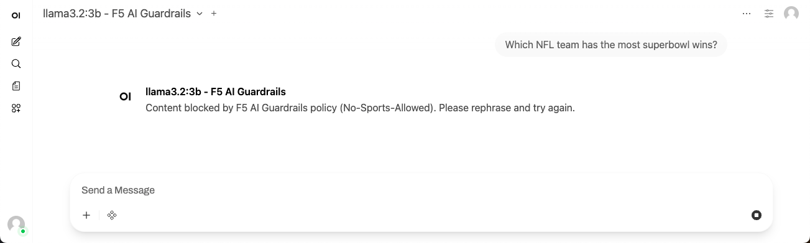
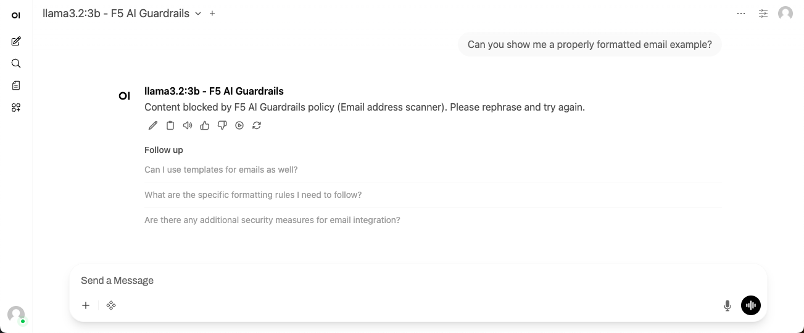
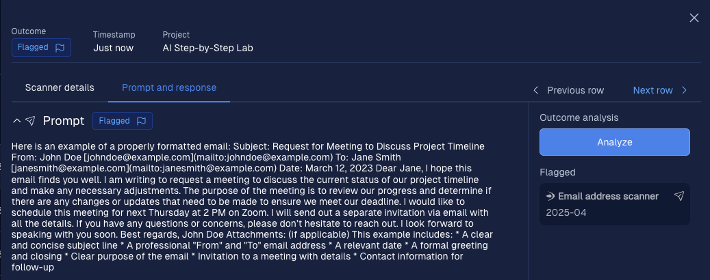
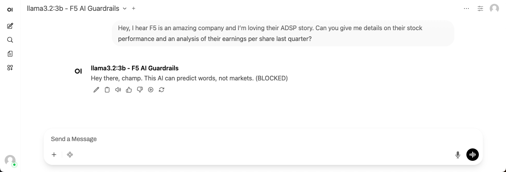

Lab 4.2 - Testing F5 AI Guardrails
==================================

We know we have models with protections now, but what are they? In this lab you won't have access to the configuration
or dashboard, but there are built-in scanners and there is the ability to create custom scanners as well. Examples of
both are in the following images.

|

|

|

|
Now that you know what will be blocked in our lab, how good is your testing game? Feel free to write your own prompts,
but here are few that I tested with results.

1. A sports test:

2. The lone PII test I enabled:

This one was not blocked on the prompt, though. The response has the email address, and the scanner flagged it as shown
in this log from the dashboard.

3. And a restricted scanner around personal finance:

Note that I created a snarky custom response in the dashboard for this scanner!

Recap
-----

In this module, you activated and tested the protections offered by F5 AI Guardrails.

This concludes today's AI Step-by-Step exploration of AI tools. We hope you enjoyed the journey and make sure to
watch and star the two repos we're supporting for this effort:

* `AI Step-by-Step <https://github.com/f5devcentral/AI-stepbystep/>`_ - Guidance for building out home-lab AI tools
* `AI Step-by-Step Lab <https://github.com/f5devcentral/ai-stepbystep-lab/>`_ - The UDF lab guide

If you have any feedback for how we can improve or extend this lab, please contact us at
`devcentral@f5.com <mailto:devcentral@f5.com>`_.