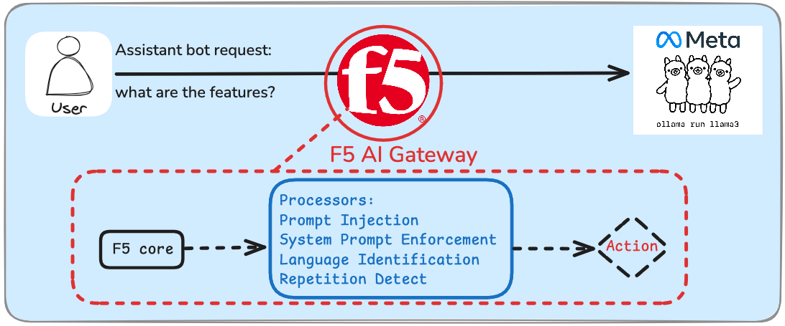

Module 4: AI Gateway Demo
=========================

The world of AI is just like the rest of the tech world -- inherently unsafe! In this Module, we'll take
a look at F5 AI Gateway. Architecturally, it sits between your clients and your models, whether on a single
system as is the case in this demo or in a scaled out production environment. 5 AI Gateway is a specialized
platform designed to route, protect, and manage generative AI traffic between clients and Large Language Model
(LLM) backends. It addresses the unique challenges posed by AI applications, particularly their non-deterministic
nature and the need for bidirectional traffic monitoring.

The main AI Gateway functions are:

Core
----

The **Core** performs the following tasks:

* Performs Authn/Authz checks, such as validating JWTs and inspecting request headers.
* Parses and performs basic validation on client requests.
* Applies **Processors** to incoming requests, which may modify or reject the request.
* Selects and routes each request to an appropriate LLM backend, transforming requests/responses to match the LLM/client schema.
* Applies **Processors** to the response from the LLM backend, which may modify or reject the response.
* Optionally, stores an auditable record of every request/response and the specific activity of each processor. These records can be exported to AWS S3 or S3-compatible storage.
* Generates and exports observability data via OpenTelemetry
* Prevents malicious inputs from reaching LLM backends
* Ensures safe LLM responses to clients
* Protects against sensitive information leaks
* Providing comprehensive logging of all requests and responses

Processors
----------

A **Processor** runs separately from the core and can perform one or more of the following actions on a request or response:

* **Modify**: A processor may rewrite a request or response. For example, by redacting credit card numbers.
* **Reject**: A processor may reject a request or response, causing the core to halt processing of the given request/response.
* **Annotate**: A processor may add tags or metadata to a request/response, providing additional information to the administrator. The core can also select the LLM backend based on these tags.

Each processor provides specific protection or transformation capabilities to AI Gateway. For example, a processor can detect and remove Personally Identifiable Information (PII) from the input or output of the AI model.

F5 AI Gateway enables organizations to confidently deploy AI applications anywhere. Easily ensure security, scalability, and reliability for your AI implementation. AI Gateway inspects inbound prompts and outbound responses to prevent unexpected outcomes or critical data leakage. Customizable observation, protection, and management of AI interactions help improve the usability of AI applications and simplifies compliance.

What are the use cases for AI Gateway?
--------------------------------------

AIGW acts as a hub for integration and streamlining of AI applications with AI services (OpenAI, Anthropic, Mistral, Ollama, etc.). Now that we have an understanding of what AI Gateway is and how it works we will need to achieve the below architecture.

General use cases:

* Prompt injections: Detect and block any prompt injections or jailbreaks

  * Prompt management
  * Prompt templates
  * RBAC for LLM providers (only access certain LLMs)
  * Prompt leakage: block before it gets to LLM

* Prompt-based routing

  * Cost effective routing
  * Best-fit model routing

* Model hallucination prevention
* Load balancing (failover, circuit breaking)
* Rate limiting
* AuthN/AuthZ
* Centrally manage credentials (such as API keys to AI services)
* PII Leakage / Data leakage: Accidental leakage of personal information from LLM (i.e. financial, health care information)

  * Email address
  * Social Security Number (SSN)
  * Date of birth
  * Credit card numbers
  * Data exfiltration

In this lab, we'll focus on demoing a couple practical examples of AI Gateway use cases. For a deep dive into
how to set up and configure AI Gateway, please register for the `test drive lab
<https://www.f5.com/company/events/test-drive-labs>`_ on either Aug 26th or Sept 16th or ask your field engineer
to set up a UDF session for you.

.. toctree::
   :maxdepth: 1
   :glob:

   lab*
